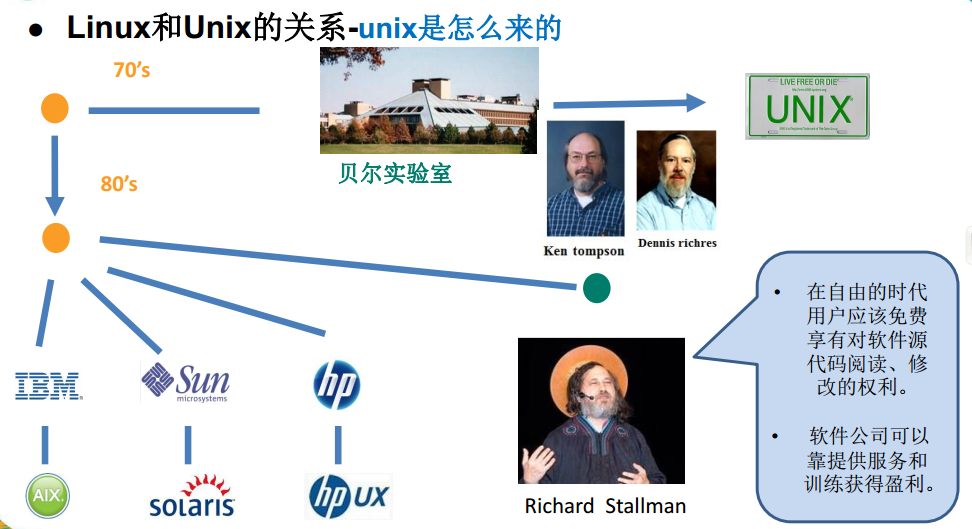
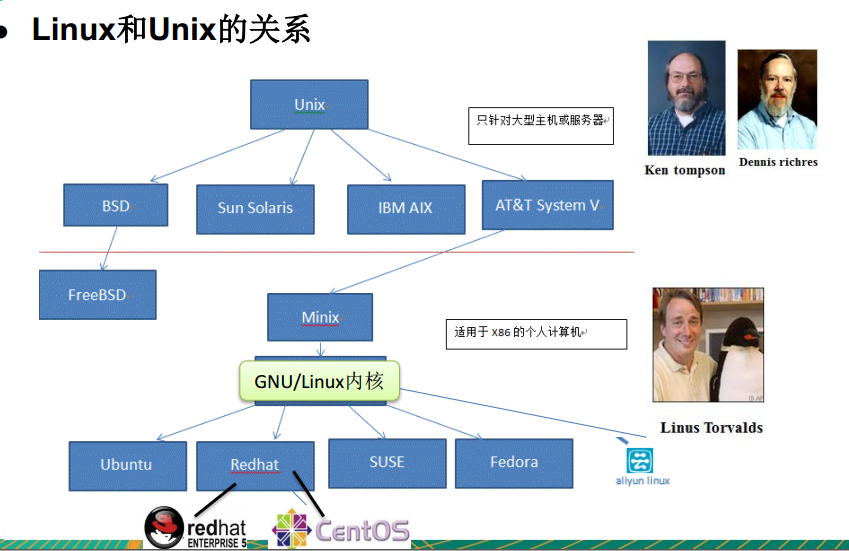

# Linux 简介

## 学习路线

第1阶段： linux环境下的基本操作命令， 包括 文件操作命令(rm mkdir chmod, chown) 编
辑工具使用（vi vim） linux用户管理(useradd userdel usermod)等
第2阶段： linux的各种配置（环境变量配置，网络配置，服务配置）
第3阶段： linux下如何搭建对应语言的开发环境（大数据， JavaEE, Python等）
第4阶段： 能编写shell脚本，对Linux服务器进行维护。
第5阶段： 能进行安全设置， 防止攻击，保障服务器正常运行，能对系统调优。
第6阶段： 深入理解Linux系统（对内核有研究），熟练掌握大型网站应用架构组成、并熟
悉各个环节的部署和维护方法 

## 基础篇

1. Linux 与 Unix 的关系

2. 安装 VM 与 CentOS 

[安装包](https://pan.baidu.com/s/1PKB2vTrtkmGgToNB7dzjZw) 提取码：`dlhv`

