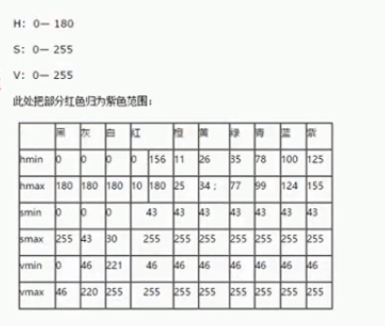
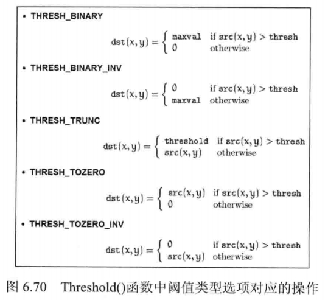
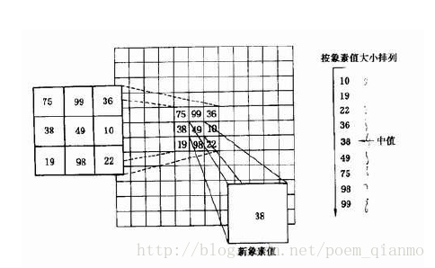
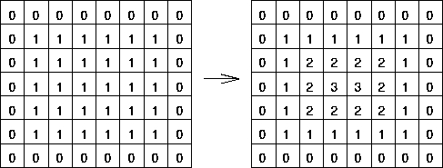
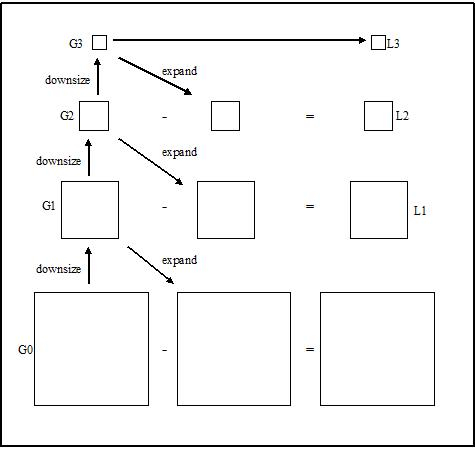
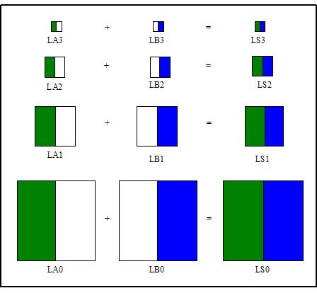
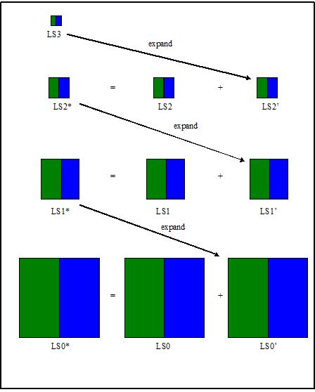

[TOC]

```python
import cv2
cv2.__version__
```


    '3.4.1'

### 更改色彩空间

学习目标：
- 改变色彩空间 $BGR \leftrightarrow Gray, BGR \leftrightarrow HSV$ 等。
- 创建一个应用程序来提取视频中的彩色对象
- cv2.cvtColor(), cv2.inRange() 

#### 改变色彩空间
OpenCV 中有 150 多种色彩空间转化的方法，这里只讨论两种：$BGR \leftrightarrow Gray, BGR \leftrightarrow HSV$


```python
import cv2
import numpy as np
```


```python
# OpenCV 中色彩空间的方法
flags = [i for i in dir(cv2) if i.startswith('COLOR_')]
flags
```

```
['COLOR_BAYER_BG2BGR',
 'COLOR_BAYER_BG2BGRA',
 'COLOR_BAYER_BG2BGR_EA',
 'COLOR_BAYER_BG2BGR_VNG',
 'COLOR_BAYER_BG2GRAY',
 'COLOR_BAYER_BG2RGB',
 'COLOR_BAYER_BG2RGBA',
 'COLOR_BAYER_BG2RGB_EA',
 'COLOR_BAYER_BG2RGB_VNG',
```

HSV的色相范围为[0,179]，饱和度范围为[0,255]，值范围为[0,255]。不同的软件使用不同的规模。如果要比较 OpenCV 值和它们，你需要标准化这些范围。

#### 目标跟踪

HSV 和 HLV 解释

(image/2019-3-29-OpenCV 系列教程4 - OpenCV 图像处理（上）/400px-Hsl-hsv_models.svg.png)


```python
cap = cv2.VideoCapture(0)

while(1):
    # 提取每一帧, frame 源视频
    _, frame = cap.read()

    # BGR -> HSV
    hsv = cv2.cvtColor(frame, cv2.COLOR_BGR2HSV)

    # 在 HSV 中定义蓝色的范围
    lower_blue = np.array([110, 50, 50], dtype=np.uint8)
    upper_blue = np.array([130, 255, 255], dtype=np.uint8)

    # 将 HSV 图像的阈值设置为只获取蓝色
    mask = cv2.inRange(hsv, lower_blue, upper_blue) 
    # 把像素值在 lower_blue 和 upper_blue 之间的像素置 255(白)，之外的置 0（黑）

    #
    res = cv2.bitwise_and(frame, frame, mask=mask) # 白留黑除

    cv2.imshow("frame", frame) # 源视频
    cv2.imshow("hsv", hsv) # 
    cv2.imshow("mask", mask)
    cv2.imshow("res", res)
    k = cv2.waitKey(1) & 0xFF
    if k == 27:
        break

cap.release() # 记得释放掉捕获的视频
cv2.destroyAllWindows()
```

运行结果：该段程序的作用是检测蓝色目标，同理可以检测其他颜色的目标
**结果中存在一定的噪音，之后的章节将会去掉它**


```python
import cv2
import numpy as np

def hsv_trace(img):
    """
    颜色跟踪，img 三通道图像
    """
    # BGR -> HSV
    hsv = cv2.cvtColor(img, cv2.COLOR_BGR2HSV)

    # 在 HSV 中定义蓝色的范围
    lower_blue = np.array([100, 43, 46], dtype=np.uint8)
    upper_blue = np.array([124, 255, 255], dtype=np.uint8)

    # 将 HSV 图像的阈值设置为只获取蓝色
    mask = cv2.inRange(hsv, lower_blue, upper_blue) 
    # 把像素值在 lower_blue 和 upper_blue 之间的像素置 255(白)，之外的置 0（黑）

    res = cv2.bitwise_and(img, img, mask=mask) # 白留黑除
    #cv2.imshow("hsv", hsv) # 
    #cv2.imshow("mask", mask)
    cv2.imshow("res", res)
    
    
img = cv2.imread("./sample_img/car_num_2.jpg")
hsv_trace(img)

cv2.imshow("img", img) # 源视频


cv2.waitKey(0)
cv2.destroyAllWindows()
```

这是物体跟踪中最简单的方法。一旦你学会了等高线的函数，你可以做很多事情，比如找到这个物体的质心，用它来跟踪这个物体，仅仅通过在相机前移动你的手来画图表，还有很多其他有趣的事情。

#### 如何找到要跟踪的 HSV 值?
[菜鸟教程 在线 HSV-> BGR 转换] (https://c.runoob.com/front-end/868)




```python
green = np.uint8([[[255, 0, 0]]])
hsv_green = cv2.cvtColor(green, cv2.COLOR_BGR2HSV)
hsv_green
```


    array([[[120, 255, 255]]], dtype=uint8)


比如要找出绿色的 HSV 值，可以使用上面的程序，得到的值取一个上下界。如上面的取下界 [H-10, 100, 100]，上界 [H+10, 255, 255]
或者使用其他工具如 [GIMP] (https://www.gimp.org/)

#### 更多例程（跟踪红色目标和绿色目标）

##### 红色目标


```python
import cv2
cap = cv2.VideoCapture(0)

while(1):
    # 提取每一帧, frame 源视频
    _, frame = cap.read()

    # BGR -> HSV
    hsv = cv2.cvtColor(frame, cv2.COLOR_BGR2HSV)

    # 在 HSV 中定义蓝色的范围
    lower_blue = np.array([35, 43, 46], dtype=np.uint8)
    upper_blue = np.array([77, 255, 255], dtype=np.uint8)

    # 将 HSV 图像的阈值设置为只获取蓝色
    mask = cv2.inRange(hsv, lower_blue, upper_blue) 
    # 把像素值在 lower_blue 和 upper_blue 之间的像素置 255(白)，之外的置 0（黑）

    #
    res = cv2.bitwise_and(frame, frame, mask=mask) # 白留黑除

    cv2.imshow("frame", frame) # 源视频
    cv2.imshow("hsv", hsv) # 
    cv2.imshow("mask", mask)
    cv2.imshow("res", res)
    k = cv2.waitKey(1) & 0xFF
    if k == 27:
        break

cap.release() # 记得释放掉捕获的视频
cv2.destroyAllWindows()
```

##### 绿色目标


```python
import cv2
cap = cv2.VideoCapture(0)

while(1):
    # 提取每一帧, frame 源视频
    _, frame = cap.read()

    # BGR -> HSV
    hsv = cv2.cvtColor(frame, cv2.COLOR_BGR2HSV)

    # 在 HSV 中定义蓝色的范围
    lower_blue = np.array([0, 43, 46], dtype=np.uint8)
    upper_blue = np.array([10, 255, 255], dtype=np.uint8)

    # 将 HSV 图像的阈值设置为只获取蓝色
    mask = cv2.inRange(hsv, lower_blue, upper_blue) 
    # 把像素值在 lower_blue 和 upper_blue 之间的像素置 255(白)，之外的置 0（黑）

    #
    res = cv2.bitwise_and(frame, frame, mask=mask) # 白留黑除

    cv2.imshow("frame", frame) # 源视频
    cv2.imshow("hsv", hsv) # 
    cv2.imshow("mask", mask)
    cv2.imshow("res", res)
    k = cv2.waitKey(1) & 0xFF
    if k == 27:
        break

cap.release() # 记得释放掉捕获的视频
cv2.destroyAllWindows()
```

### 图像阈值
学习目标：
- 简单阈值处理、自适应阈值处理、 Otsu's 阈值处理
- cv2.threshold, cv2.adaptiveThreshold

对图像进行阈值处理，算是一种最简单的图像分割方法，基于图像与背景之间的灰度差异，此项分割是基于像素级的分割

#### 简单阈值处理
threshold(src, thresh, maxval, type[, dst]) -> retval, dst
- src: 源图像，必须是灰度图
- thresh：阈值，用于对像素的区分
- maxval: 当像素大于等于阈值时，将像素赋值为 maxval
- 阈值样式：
```python
cv2.THRESH_BINARY # 若源像素大于阈值，设置为 maxval，否则设置为 0
cv2.THRESH_BINARY_INV # 与上面相反，若源像素大于阈值，则将像素设置为 0，否则是设置为 maxval
cv2.THRESH_TRUNC # 若源像素大于阈值，设定为阈值, maxval 被忽略 否则像素保持不变
cv2.THRESH_TOZERO # 若源像素大于阈值，保持像素不变，否则设置为 0， maxval 被忽略
cv2.THRESH_TOZERO_INV # 与上面相反，若源像素大于阈值，设置为 0，否则保持像素不变， maxval 被忽略
```
- retval: 下面介绍
- dst: 得到的图像




```python
import cv2
import numpy as np
import matplotlib.pyplot as plt

img = cv2.imread("./sample_img/gradient.png", 0)
ret, thresh1 = cv2.threshold(img, 127, 255, cv2.THRESH_BINARY)
ret, thresh2 = cv2.threshold(img, 127, 255, cv2.THRESH_BINARY_INV)
ret, thresh3 = cv2.threshold(img, 127, 255, cv2.THRESH_TRUNC)
ret, thresh4 = cv2.threshold(img, 127, 255, cv2.THRESH_TOZERO)
ret, thresh5 = cv2.threshold(img, 127, 255, cv2.THRESH_TOZERO_INV)

titles = ['Original Image', 'BINARY',
          'BINARY_INV', 'TRUNC', 'TOZERO', 'TOZERO_INV']
images = [img, thresh1, thresh2, thresh3, thresh4, thresh5]

for i in range(6):
    plt.subplot(2, 3, i+1), plt.imshow(images[i], 'gray')
    plt.title(titles[i])
    plt.xticks([]), plt.yticks([])

plt.show()
```


#### 自适应阈值处理
计算图像小区域的阈值。所以我们对同一幅图像的不同区域得到不同的阈值，这给我们在不同光照下的图像提供了更好的结果。

三个特殊的输入参数和一个输出参数

`adaptiveThreshold(src, maxValue, adaptiveMethod, thresholdType, blockSize, C[, dst]) -> dst`
- Adaptive Method：
```python
cv2.ADAPTIVE_THRESH_MEAN_C # 阈值是临近区域的平均值
cv2.ADAPTIVE_THRESH_GAUSSIAN_C # 阈值是权值为高斯窗口的邻域值的加权和。
```
- thresholdType 
```python
THRESH_BINARY # 若源像素大于阈值，则像素赋值 maxval，否则为 0
THRESH_BINARY_INV # 与上面相反
```
- Block Size：
决定临近区域的大小，$BlockSize*BlockSize$，取3，5，7等（取奇数）
- C：
从计算的平均值或加权平均值中减去的一个常数。


```python
import cv2
import numpy as np
from matplotlib import pyplot as plt

img = cv2.imread('./sample_img/dave.png', 0)
img = cv2.medianBlur(img, 5)

ret, th1 = cv2.threshold(img, 127, 255, cv2.THRESH_BINARY)
# 若源像素大于阈值（阈值为临近区域的平均值减去常数），设置为 maxval， 否则置 0
th2 = cv2.adaptiveThreshold(
    img, 255, cv2.ADAPTIVE_THRESH_MEAN_C, cv2.THRESH_BINARY, 3, 4)
th3 = cv2.adaptiveThreshold(
    img, 255, cv2.ADAPTIVE_THRESH_GAUSSIAN_C, cv2.THRESH_BINARY, 3, 4)

titles = ['Original Image', 'Global Thresholding (v = 127)',
          'Adaptive Mean Thresholding', 'Adaptive Gaussian Thresholding']
images = [img, th1, th2, th3]
"""
cv2.imshow("th1", th1)
cv2.imshow("th2", th2)
cv2.imshow("th3", th3)
cv2.waitKey(0)
cv2.destroyAllWindows()
"""
for i in range(4):
    plt.subplot(2, 2, i+1)
    plt.imshow(images[i], 'gray')
    plt.title(titles[i])
    plt.xticks([]), plt.yticks([])
plt.show()
```


#### Otsu’s 二值化


```python
import cv2
import numpy as np
from matplotlib import pyplot as plt

img = cv2.imread("./sample_img/noisy2.png", 0)

# global thresholding
ret1, th1 = cv2.threshold(img, 127, 255, cv2.THRESH_BINARY)

# Otsu's thresholding
ret2, th2 = cv2.threshold(img, 0, 255, cv2.THRESH_BINARY+cv2.THRESH_OTSU)

# Otsu's thresholding after Gaussian filtering
blur = cv2.GaussianBlur(img, (5, 5), 0)
ret3, th3 = cv2.threshold(blur, 0, 255, cv2.THRESH_BINARY+cv2.THRESH_OTSU)

# plot all the images and their histograms
images = [img, 0, th1,
          img, 0, th2,
          blur, 0, th3]
titles = ['Original Noisy Image', 'Histogram', 'Global Thresholding (v=127)',
          'Original Noisy Image', 'Histogram', "Otsu's Thresholding",
          'Gaussian filtered Image', 'Histogram', "Otsu's Thresholding"]

for i in range(3):
    plt.subplot(3, 3, i*3+1), plt.imshow(images[i*3], 'gray')
    plt.title(titles[i*3]), plt.xticks([]), plt.yticks([])
    plt.subplot(3, 3, i*3+2), plt.hist(images[i*3].ravel(), 256)
    plt.title(titles[i*3+1]), plt.xticks([]), plt.yticks([])
    plt.subplot(3, 3, i*3+3), plt.imshow(images[i*3+2], 'gray')
    plt.title(titles[i*3+2]), plt.xticks([]), plt.yticks([])
plt.show()
```


##### 原理


```python
import numpy as np


def OTSU_enhance(img_gray, th_begin=0, th_end=256, th_step=1):

    max_g = 0
    suitable_th = 0
    for threshold in range(th_begin, th_end, th_step):
        bin_img = img_gray > threshold
        bin_img_inv = img_gray <= threshold
        fore_pix = np.sum(bin_img)
        back_pix = np.sum(bin_img_inv)
        if 0 == fore_pix:
            break
        if 0 == back_pix:
            continue

        w0 = float(fore_pix) / img_gray.size  # 前景像素点占整幅图像大小的比例
        u0 = float(np.sum(img_gray * bin_img)) / fore_pix  # 前景像素点的平均值
        w1 = float(back_pix) / img_gray.size  # 背景像素点占整幅图像大小的比例
        u1 = float(np.sum(img_gray * bin_img_inv)) / back_pix  # 前景像素点的平均值
        # intra-class variance
        g = w0 * w1 * (u0 - u1) * (u0 - u1)
        if g > max_g:
            max_g = g
            suitable_th = threshold
    return suitable_th


img = cv2.imread("./sample_img/1.jpg", 0)
threshold = OTSU_enhance(gray)
ret, thresh1 = cv2.threshold(img, 127, 255, cv2.THRESH_BINARY)
_, thresh2 = cv2.threshold(img, 127, 255, cv2.THRESH_OTSU)
cv2.imshow("thresh1", thresh1)
cv2.imshow("thresh2", thresh2)

cv2.waitKey(0)
cv2.destroyAllWindows()
```


```python
img_gray = cv2.imread("./sample_img/1.jpg", 0)
bin_img = img_gray > 0
img*bin_img
```


    array([[ True,  True,  True, ...,  True,  True,  True],
           [ True,  True,  True, ...,  True,  True,  True],
           [ True,  True,  True, ...,  True,  True,  True],
           ...,
           [ True,  True,  True, ...,  True,  True,  True],
           [ True,  True,  True, ...,  True,  True,  True],
           [ True,  True,  True, ...,  True,  True,  True]])


#### 更多资料
[opencv-threshold-python] (https://www.learnopencv.com/opencv-threshold-python-cpp/)

[OpenCV 图片集] (https://github.com/opencv/opencv/tree/master/samples/data)

[本节原文] (https://opencv-python-tutroals.readthedocs.io/en/latest/py_tutorials/py_imgproc/py_thresholding/py_thresholding.html#thresholding)

### 图像的几何变换
学习目标：
- 学习将不同的几何变换应用于图像，如平移、旋转、仿射变换等。
- cv2.getPerspectiveTransform

#### 变换
OpenCV 提供两种变换函数：`cv2.warpAffine` 和 `cv2.warpPerspective`

##### 缩放
`cv2.resize()` 完成缩放
- src: 输入的图像
- dsize: 输出图像的大小，设置为 None 则由 fx, fy 决定
- fx: 宽度的缩放比例
- fy: 高度的缩放比例
- interpolation：插值方法
    - INTER_NEAREST - 最近邻插值 (速度最快)
    - INTER_LINEAR - 双线性插值（默认） **放大的效果还 OK ，速度较快**
    - INTER_AREA - 使用像素区域关系重新采样。它可能是图像抽取的首选方法，因为它可以提供无莫尔条纹的结果。但是当图像被缩放时，它类似于 INTER_NEAREST 方法。 **缩小图像效果最好的方法**
    - INTER_CUBIC - 4x4 像素邻域上的双三次插值 **放大的效果最好（慢）**
    - INTER_LANCZOS4 - 8x8 像素邻域的 Lanczos 插值
- dst: 输出图像

[文档说明] (https://docs.opencv.org/2.4/modules/imgproc/doc/geometric_transformations.html?highlight=resize#resize)


```python
import cv2
import numpy as np
import matplotlib.pyplot as plt

def opencv2matplot(src):
    """
    将 opencv 颜色通道转换成 matplot 的颜色通道
    """
    b, g, r = cv2.split(src)
    return cv2.merge([r, g, b])


img = cv2.imread("./sample_img/messi5.jpg")
# 方法一
res = cv2.resize(img, None, fx=2, fy=3, interpolation=cv2.INTER_CUBIC)
# 方法二
height, width = img.shape[:2]
res_2 = cv2.resize(img, (2*width, 2*height), interpolation=cv2.INTER_CUBIC)

images = [img, res, res_2]
img_title = ['Original', "method_1", "method_2"]
for i, img in enumerate(images):
    plt.subplot(1, 3, i+1)
    plt.imshow(opencv2matplot(img))
    plt.title(img_title[i])

plt.show()
```

运行结果


```python
%timeit -r 10 res = cv2.resize(img, None, fx=2, fy=3, interpolation=cv2.INTER_CUBIC)
%timeit -r 10 res = cv2.resize(img, None, fx=2, fy=3, interpolation=cv2.INTER_LINEAR)
%timeit -r 10 res = cv2.resize(img, None, fx=2, fy=3, interpolation=cv2.INTER_NEAREST)
%timeit -r 10 res = cv2.resize(img, None, fx=2, fy=3, interpolation=cv2.INTER_AREA)
%timeit -r 10 res = cv2.resize(img, None, fx=2, fy=3, interpolation=cv2.INTER_LANCZOS4)
```

    13.5 ms ± 680 µs per loop (mean ± std. dev. of 10 runs, 100 loops each)
    17.2 ms ± 2.2 ms per loop (mean ± std. dev. of 10 runs, 100 loops each)
    12.1 ms ± 1.85 ms per loop (mean ± std. dev. of 10 runs, 100 loops each)
    20.5 ms ± 7 ms per loop (mean ± std. dev. of 10 runs, 100 loops each)
    79.3 ms ± 2.19 ms per loop (mean ± std. dev. of 10 runs, 10 loops each)


**说明** : `cv2.INTER_LINEAR` 方法比 `cv2.INTER_CUBIC` 还慢，好像与官方文档说的不一致？ 有待验证。

速度比较： INTER_CUBIC > INTER_NEAREST > INTER_LINEAR > INTER_AREA > INTER_LANCZOS4

##### 平移
改变图像的位置，创建一个 `np.float32` 类型的变换矩阵，

$M = \begin{bmatrix} 1 & 0 & t_x \\ 0 & 1 & t_y \end{bmatrix}$

`warpAffine(src, M, dsize[, dst[, flags[, borderMode[, borderValue]]]]) -> dst`
- src: 源图像
- M：变换矩阵。 $t_x$（列偏移） $t_y$（行偏移） 就是要偏移的量
- dsize: 输出图像的大小，形式如： (width, height)。width：列数， height：行数


```python
import cv2
import numpy as np

img = cv2.imread('messi5.jpg', 0)
rows,cols = img.shape 

M = np.float32([[1,0,100],[0,1,50]])
dst = cv2.warpAffine(img, M, (cols,rows))

cv2.imshow('img',dst)
cv2.waitKey(0)
cv2.destroyAllWindows()
```

运行结果：


##### 旋转
旋转角度（$\theta$）是通过一个变换矩阵变换的：
$M = \begin{bmatrix}\cos\theta & -\sin\theta \\ \sin\theta & \cos\theta \end{bmatrix}$

OpenCV 提供的是可调旋转中心的缩放旋转，这样你可以在任何你喜欢的位置旋转。修正后的变换矩阵为
$\begin{bmatrix} \alpha &  \beta & (1- \alpha )  \cdot center.x -  \beta \cdot center.y \\ - \beta &  \alpha &  \beta \cdot center.x + (1- \alpha )  \cdot center.y \end{bmatrix}$

这里 
$\begin{array}{l} \alpha =  scale \cdot \cos \theta , \\ \beta =  scale \cdot \sin \theta \end{array}$


OpenCV 提供了 `cv2.getRotationMatrix2D` 控制
cv2.getRotationMatrix2D(center, angle, scale) → retval
- center: 源图像的旋转中心
- angle: 角度的旋转。正值表示逆时针旋转(假设坐标原点为左上角)。
- scale: 比例因子


```python
img = cv2.imread("messi5.jpg", 0)
rows, cols = img.shape

M = cv2.getRotationMatrix2D((cols/2, rows/2), 90, 0.9)
# 设置旋转中心为源图像的图中心，逆时针旋转 90 度，缩放比例为 0.9

dst = cv2.warpAffine(img, M, (cols, rows))

cv2.imshow("img", img)
cv2.imshow("dst", dst)
cv2.waitKey(0)
cv2.destroyAllWindows()
```

运行结果


##### 仿射变换

cv2.getAffineTransform(src, dst) → retval
- src: 源图像中三角形顶点的坐标。
- dst: 目标图像中相应三角形顶点的坐标。
- retval: 得到一个矩阵 map_matrix

函数关系：
$\begin{bmatrix} x'_i \\ y'_i \end{bmatrix}$ = $\texttt {map_matrix} \cdot \begin{bmatrix} x_i \\ y_i \\ 1 \end{bmatrix}$

其中
$dst(i)=(x'_i,y'_i), src(i)=(x_i, y_i), i=0,1,2$

###### 例程 1


```python
# 创建一个测试图片，便于观察
img = np.zeros((512, 512, 3), dtype=np.uint8) + 255
cv2.circle(img, (50, 50), 7, (255, 0, 0), -1)
cv2.circle(img, (200, 50), 7, (255, 0, 0), -1)
cv2.circle(img, (50, 200), 7, (255, 0, 0), -1)
cv2.imwrite("./sample_img/drawing_2.png", img)
cv2.imshow("img", img)
cv2.waitKey(0)
cv2.destroyAllWindows()
```


```python
%matplotlib notebook
def opencv2matplot(src):
    """
    将 opencv 颜色通道转换成 matplot 的颜色通道
    """
    b, g, r = cv2.split(src)
    return cv2.merge([r, g, b])


img = cv2.imread("./sample_img/drawing_2.png")
#img = cv2.resize(img, None, fx=0.2, fy=0.2, interpolation=cv2.INTER_NEAREST) # 源图片太大了，进行缩放
rows, cols, ch = img.shape

pts1 = np.float32([[50, 50], [200, 50], [50, 200]])
pts2 = np.float32([[10, 100], [200, 50], [100, 250]])

M = cv2.getAffineTransform(pts1, pts2)

dst = cv2.warpAffine(img, M, (cols, rows))

plt.subplot(1, 2, 1)
plt.imshow(img)

plt.subplot(1, 2, 2)
plt.imshow(dst)
plt.show()

cv2.imshow("img", img)
cv2.imshow("dst", dst)
cv2.waitKey(0)
cv2.destroyAllWindows()
```

运行结果：图上的点便于观察，两图中的红点是相互对应的


###### 平移


```python
import numpy as np
import cv2
import matplotlib.pyplot as plt

def opencv2matplot(src):
    """
    将 opencv 颜色通道转换成 matplot 的颜色通道
    """
    b, g, r = cv2.split(src)
    return cv2.merge([r, g, b])


img = cv2.imread("./sample_img/drawing_2.png")
#img = cv2.resize(img, None, fx=0.2, fy=0.2, interpolation=cv2.INTER_NEAREST) # 源图片太大了，进行缩放
rows, cols, ch = img.shape

pts1 = np.float32([[50, 50], [200, 50], [50, 200]])
pts2 = np.float32([[100, 100], [250, 100], [100, 250]])

M = cv2.getAffineTransform(pts1, pts2)

dst = cv2.warpAffine(img, M, (cols, rows))

plt.subplot(1, 2, 1)
plt.imshow(img)

plt.subplot(1, 2, 2)
plt.imshow(dst)
plt.show()


```

##### 透视转换
透视变换需要一个 3x3 变换矩阵。转换之后直线仍然保持笔直，要找到这个变换矩阵，需要输入图像上的 4 个点和输出图像上的对应点。在这 4 个点中，有 3 个不应该共线。通过 `cv2.getPerspectiveTransform` 计算得到变换矩阵，得到的矩阵 `cv2.warpPerspective` 变换得到最终结果。


```python
img = cv2.imread("./sample_img/sudokusmall.png")
rows, cols, ch = img.shape

pts1 = np.float32([[73, 85], [488, 71], [36, 513], [518, 518]])
pts2 = np.float32([[0, 0], [350, 0], [0, 350], [350, 350]])

M = cv2.getPerspectiveTransform(pts1, pts2)                

dst = cv2.warpPerspective(img, M, (350, 350))
cv2.imwrite("dst.png", dst)
plt.subplot(121),plt.imshow(img),plt.title('Input')
plt.subplot(122),plt.imshow(dst),plt.title('Output')
plt.show()

cv2.imshow("img", img)
cv2.imshow("dst", dst)
cv2.waitKey(0)
cv2.destroyAllWindows()
```


#### 更多资料
[本节原文] (https://opencv-python-tutroals.readthedocs.io/en/latest/py_tutorials/py_imgproc/py_geometric_transformations/py_geometric_transformations.html)

### 线性滤波：方框滤波、均值滤波、高斯滤波

#### 平滑处理
平滑处理（smoothing）也称模糊处理（bluring）,是一种简单且使用频率很高的图像处理方法。平滑处理的用途：常见是用来**减少图像上的噪点或失真**。在涉及到降低图像分辨率时，平滑处理是很好用的方法。

#### 图像滤波与滤波器
图像滤波：尽量保留图像细节特征的条件下对目标图像的噪声进行抑制，其处理效果的好坏将直接影响到后续图像处理和分析的有效性和可靠性。

消除图像中的噪声成分叫做图像的平滑化或滤波操作。信号或图像的能量大部分集中在幅度谱的低频和中频段，在高频段，有用的信息会被噪声淹没。因此一个能降低高频成分幅度的滤波器就能够减弱噪声的影响。

滤波的目的：抽出对象的特征作为图像识别的特征模式；为适应图像处理的要求，消除图像数字化时混入的噪声。

滤波处理的要求：不能损坏图像的轮廓及边缘等重要信息；图像清晰视觉效果好。

平滑滤波是低频增强的空间滤波技术，目的：模糊和消除噪音。

空间域的平滑滤波一般采用简单平均法，即求邻近像元点的平均亮度值。邻域的大小与平滑的效果直接相关，邻域越大平滑效果越好，但是邻域过大，平滑也会使边缘信息的损失的越大，从而使输出图像变得模糊。因此需要选择合适的邻域。

滤波器：一个包含加权系数的窗口，利用滤波器平滑处理图像时，把这个窗口放在图像上，透过这个窗口来看我们得到的图像。

#### 线性滤波器
线性滤波器：用于剔除输入信号中不想要的频率或者从许多频率中选择一个想要的频率。
低通滤波器、高通滤波器、带通滤波器、带阻滤波器、全通滤波器、陷波滤波器

#### 常用滤波器
##### 方框滤波器 (boxblur 函数)
`boxFilter(src, ddepth, ksize[, dst[, anchor[, normalize[, borderType]]]]) -> dst`
- src: 源图片
- ddepth: 输出图像的深度， -1 代表使用原图深度
- kesize: 核
- dst: 输出图像
- anchor：锚点，表示要处理的像素点 (-1, -1) 代表核的中心
- normalize：表示内核是否被归一化，默认值: True **值为 True 时与 cv2.blur() 作用相同**。  
- borderType：图像边缘处理参数

均值滤波是方框滤波归一化后的特殊情况。归一化就是要把处理的量缩放到一个范围内如 (0,1)，以便统一处理和直观量化。非归一化的方框滤波用于计算每个像素邻近内的积分特性，比如密集光流算法中用到的图像倒数的协方差矩阵。


```python
import cv2
import numpy as np

img = cv2.imread("./sample_img/opencv-logo.png")

boxFilter = cv2.boxFilter(img, -1, (5, 5), normalize=False) 

cv2.imshow("original", img)
cv2.imshow("boxFilter", boxFilter)
cv2.waitKey(0)
cv2.destroyAllWindows()
```

运行结果：


###### 程序说明原理


```python
# 构造一个例子进行说明
temp = np.array([i for i in range(25)], dtype=np.uint8).reshape(5, 5)

# cv2.BORDER_DEFAULT 是对边缘进行镜像操作
result = cv2.boxFilter(temp, -1, (3, 3), normalize=False)
print("temp:", temp, "result:", result, "copyMakeBorder:", cv2.copyMakeBorder(temp, 1, 1, 1, 1, cv2.BORDER_DEFAULT), sep='\n')
```

    temp:
    [[ 0  1  2  3  4]
     [ 5  6  7  8  9]
     [10 11 12 13 14]
     [15 16 17 18 19]
     [20 21 22 23 24]]
    result:
    [[ 36  39  48  57  60]
     [ 51  54  63  72  75]
     [ 96  99 108 117 120]
     [141 144 153 162 165]
     [156 159 168 177 180]]
    copyMakeBorder:
    [[ 6  5  6  7  8  9  8]
     [ 1  0  1  2  3  4  3]
     [ 6  5  6  7  8  9  8]
     [11 10 11 12 13 14 13]
     [16 15 16 17 18 19 18]
     [21 20 21 22 23 24 23]
     [16 15 16 17 18 19 18]]


##### 均值滤波（ blur 函数）

均值滤波是典型的线性滤波算法，主要方法为邻域平均法，即用一片图像区域的各个像素的均值来代替原图像中的各个像素值。一般需要在图像上对目标像素给出一个模板（内核），该模板包括了其周围的临近像素（比如以目标像素为中心的周围8（3x3-1）个像素，构成一个滤波模板，即**去掉目标像素本身**）。再用模板中的全体像素的平均值来代替原来像素值。即对待处理的当前像素点（x，y），选择一个模板，该模板由其近邻的若干像素组成，求模板中所有像素的均值，再把该均值赋予当前像素点（x，y），作为处理后图像在该点上的灰度个g（x，y），即个g（x，y）=1/m ∑f（x，y） ，其中m为该模板中包含当前像素在内的像素总个数。


均值滤波本身存在着固有的缺陷，即它不能很好地保护图像细节，在图像去噪的同时也破坏了图像的细节部分，从而使图像变得模糊，不能很好地去除噪声点。


`cv2.blur(src, ksize[, dst[, anchor[, borderType]]]) → dst`
- src：源图像
- ksize：内核大小 （k, k） 
- anchor: 锚点 默认值点(- 1,1) 表示锚点位于内核中心。 
- borderType：用于外推图像像素的边界模式。一般使用默认值即可。


```python
import cv2
import numpy as np

img = cv2.imread("./sample_img/opencv-logo.png")

blur = cv2.blur(img, (5, 5)) 

cv2.imshow("original", img)
cv2.imshow("blur", blur)
cv2.waitKey(0)
cv2.destroyAllWindows()
```

结果：


###### 程序说明原理：图像边缘的处理


```python
# 构造一个例子进行说明
temp = np.array([i for i in range(25)], dtype=np.uint8).reshape(5, 5)

# cv2.BORDER_DEFAULT 是对边缘进行镜像操作
result = cv2.blur(temp, (3, 3))
print("temp:", temp, "result:", result, "copyMakeBorder:", cv2.copyMakeBorder(temp, 1, 1, 1, 1, cv2.BORDER_DEFAULT), sep='\n')
```

    temp:
    [[ 0  1  2  3  4]
     [ 5  6  7  8  9]
     [10 11 12 13 14]
     [15 16 17 18 19]
     [20 21 22 23 24]]
    result:
    [[ 4  4  5  6  7]
     [ 6  6  7  8  8]
     [11 11 12 13 13]
     [16 16 17 18 18]
     [17 18 19 20 20]]
    copyMakeBorder:
    [[ 6  5  6  7  8  9  8]
     [ 1  0  1  2  3  4  3]
     [ 6  5  6  7  8  9  8]
     [11 10 11 12 13 14 13]
     [16 15 16 17 18 19 18]
     [21 20 21 22 23 24 23]
     [16 15 16 17 18 19 18]]


##### 高斯滤波

高斯滤波：线性滤波，可以消除高斯噪声，广泛应用于图像处理的减噪过程。高斯滤波就是对整幅图像进行加权平均的过程，每一个像素点的值，都由其本身和邻域内的其他像素值经过**加权平均**后得到。高斯滤波的具体操作是：用一个模板（或称卷积、掩模）扫描图像中的每一个像素，用模板确定的邻域内像素的加权平均灰度值去替代模板中心像素点的值。

高斯滤波有用但是效率不高。

高斯模糊技术生成的图像，其视觉效果就像是经过一个半透明屏幕在观察图像，这与镜头焦外成像效果散景以及普通照明阴影中的效果都明显不同。高斯平滑也用于计算机视觉算法中的预先处理阶段，以增强图像在不同比例大小下的图像效果（参见尺度空间表示以及尺度空间实现）。从数学的角度来看，图像的高斯模糊过程就是图像与正态分布做卷积。由于正态分布又叫作高斯分布，所以这项技术就叫作高斯模糊。

高斯滤波器是一类根据高斯函数的形状来选择权值的线性平滑滤波器。**高斯平滑滤波器对于抑制服从正态分布的噪声非常有效。**

一维零均值高斯函数为: $G(x) = \exp (-x^2 / 2\sigma^2)$ 高斯分布参数 $\sigma$ 决定了高斯函数的宽度。

对于图像处理来说，常用二维零均值离散高斯函数作平滑滤波器。二维高斯函数为： 


高斯噪声的产生
- 图像传感器在拍摄时视场不够明亮、亮度不够均匀；
- 电路各元器件自身噪声和相互影响；
- 图像传感器长期工作，温度过高。


`GaussianBlur(src, ksize, sigmaX[, dst[, sigmaY[, borderType]]]) -> dst`
- src: 源图片
- ksize: 内核大小,。其中 ksize.width 和 ksize.height 可以不同，但他们都必须为正数和奇数。或者，它们可以是零的，它们都是由 sigma 计算而来。
- sigmaX: 表示高斯核函数在 X 方向的的标准偏差。
- dst：目标输出
- sigmaY：表示高斯核函数在 Y 方向的的标准偏差。若 sigmaY 为零，就将它设为 sigmaX ，如果 sigmaX 和 sigmaY 都是 0，那么就由 ksize.width 和ksize.height 计算出来。
- borderType: 边缘处理参数 


```python
import cv2
import numpy as np

img = cv2.imread("./sample_img/opencv-logo.png")

blur = cv2.GaussianBlur(img, (5, 5), 0) 

cv2.imshow("original", img)
cv2.imshow("blur", blur)
cv2.waitKey(0)
cv2.destroyAllWindows()
```


##### 综合例程


```python
import cv2
import numpy as np

def nothing(x):
    pass

img_box = cv2.imread("./sample_img/opencv-logo.png")
img_blur = img_Gauusian = img_box
cv2.namedWindow("image_boxFilter")
cv2.namedWindow("image_blur")
cv2.namedWindow("image_GaussianBlur")

cv2.createTrackbar("boxFilter", "image_boxFilter", 1, 8, nothing)
cv2.createTrackbar("blur", "image_blur", 1, 8, nothing)
cv2.createTrackbar("GaussianBlur", "image_GaussianBlur", 1, 8, nothing)


while(1):
    box_val = cv2.getTrackbarPos("boxFilter", "image_boxFilter")
    blur_val = cv2.getTrackbarPos("blur", "image_blur")
    guassian_val = cv2.getTrackbarPos("GaussianBlur", "image_GaussianBlur")
    
    """     
    if (box_val == 0) | (blur_val == 0) | (guassian_val == 0):
        box_val = 1
        blur_val = 1
        guassian_val = 1
    """   
    
    img_box_dst = cv2.boxFilter(img_box, -1, (2*box_val+1, 2*box_val+1), normalize=False)
    img_blur_dst = cv2.blur(img_blur, (2*blur_val+1, 2*blur_val+1))
    """    
    if guassian_val % 2 == 1:
        img_Gauusian_dst = cv2.GaussianBlur(img_Gauusian, (guassian_val, guassian_val), 0)
    else:
        guassian_val = guassian_val+1
    """
    img_Gauusian_dst = cv2.GaussianBlur(img_Gauusian, (2*guassian_val+1, 2*guassian_val+1), 0)
        
    
    cv2.imshow("image_boxFilter", img_box_dst)
    cv2.imshow("image_blur", img_blur_dst)
    cv2.imshow("image_GaussianBlur", img_Gauusian_dst)
    
    k = cv2.waitKey(1) & 0xFF
    if k == 27:
        break
    


cv2.destroyAllWindows()
```

> 几点说明：
- 以上所有滤波器的内核值不能为 0，故在程序中设置了当轨迹条值为 0 时，重置为 1。
- 高斯滤波器的内核值必须为奇数如：(1, 1)、(3, 3) 等，程序中设置当轨迹条为偶数时，加 1

#### 非线性滤波：中值滤波、双边滤波
线性滤波容易构造，并且易于从频率响应的角度来进行分析。

许多情况，使用近邻像素的非线性滤波会得到更好的结果。比如在噪声是散粒噪声而不是高斯噪声，即图像偶尔会出现很大值的时候，用高斯滤波器进行图像模糊时，噪声像素不会被消除，而是转化为更为柔和但仍然可见的散粒。

##### 中值滤波

中值滤波（Median filter）是一种典型的非线性滤波技术，基本思想是用像素点邻域灰度值的中值来代替该像素点的灰度值，该方法在去除脉冲噪声、椒盐噪声『椒盐噪声又称脉冲噪声，它随机改变一些像素值，是由图像传感器，传输信道，解码处理等产生的黑白相间的亮暗点噪声。椒盐噪声往往由图像切割引起。』的同时又能保留图像边缘细节，

中值滤波是基于排序统计理论的一种能有效抑制噪声的非线性信号处理技术，其基本原理是把数字图像或数字序列中一点的值用该点的一个邻域中各点值的中值代替，让周围的像素值接近的真实值，从而消除孤立的噪声点，对于**斑点噪声（speckle noise）和椒盐噪声（salt-and-pepper noise）**来说尤其有用，因为它不依赖于邻域内那些与典型值差别很大的值。中值滤波器在处理连续图像窗函数时与线性滤波器的工作方式类似，但滤波过程却不再是加权运算。

中值滤波在一定的条件下可以克服常见线性滤波器如最小均方滤波、方框滤波器、均值滤波等带来的图像细节模糊，而且对滤除脉冲干扰及图像扫描噪声非常有效，也常用于保护边缘信息, 保存边缘的特性使它在不希望出现边缘模糊的场合也很有用，是非常经典的平滑噪声处理方法。

与均值滤波比较：
- 优势：消除噪声和保护边缘的效果好
- 劣势：消耗的时间是均值滤波的 5 倍左右

说明：中值滤波在一定条件下，可以克服线性滤波器（如均值滤波等）所带来的图像细节模糊，而且对滤除脉冲干扰即图像扫描噪声最为有效。在实际运算过程中并不需要图像的统计特性，也给计算带来不少方便。**但是对一些细节多，特别是线、尖顶等细节多的图像不宜采用中值滤波。**

###### 程序说明原理


> 疑问？ 图像的边缘中值滤波是如何处理的？


```python
# 边缘处理
img = cv2.imread("./sample_img/pic2.png", 0)
img = img[0:5, 0:5]
result = cv2.medianBlur(img, 3)
img, result, cv2.copyMakeBorder(img, 1, 1, 1, 1, cv2.BORDER_DEFAULT)
```


    (array([[239, 201, 241, 250, 214],
            [255, 119, 255, 202, 219],
            [255, 175, 236, 134, 195],
            [254, 193, 216, 247, 156],
            [219, 247, 248, 212, 168]], dtype=uint8),
     array([[239, 239, 241, 241, 214],
            [239, 239, 202, 219, 214],
            [254, 236, 202, 216, 195],
            [247, 236, 216, 212, 168],
            [219, 247, 247, 212, 168]], dtype=uint8),
     array([[119, 255, 119, 255, 202, 219, 202],
            [201, 239, 201, 241, 250, 214, 250],
            [119, 255, 119, 255, 202, 219, 202],
            [175, 255, 175, 236, 134, 195, 134],
            [193, 254, 193, 216, 247, 156, 247],
            [247, 219, 247, 248, 212, 168, 212],
            [193, 254, 193, 216, 247, 156, 247]], dtype=uint8))


###### 中值滤波例程


```python
import cv2
import numpy as np

img = cv2.imread("./sample_img/pic2.png")

median = cv2.medianBlur(img, 3)


cv2.imshow("img", img)
cv2.imshow("median", median)
cv2.waitKey(0)
cv2.destroyAllWindows()
```


##### 双边滤波
双边滤波（Bilateral filter）是一种非线性的滤波方法，是结合**图像的空间邻近度和像素值相似度**的一种折衷处理，同时考虑空域信息和灰度相似性，达到保边去噪的目的。具有简单、非迭代、局部的特点。

双边滤波器的好处是可以做边缘保存（edge preserving），一般过去用的维纳滤波或者高斯滤波去降噪，都会较明显地模糊边缘，对于高频细节的保护效果并不明显。双边滤波器顾名思义比高斯滤波多了一个高斯方差 sigma－d ，它是基于空间分布的高斯滤波函数，所以在边缘附近，离的较远的像素不会太多影响到边缘上的像素值，这样就保证了边缘附近像素值的保存。**但是由于保存了过多的高频信息，对于彩色图像里的高频噪声，双边滤波器不能够干净的滤掉，只能够对于低频信息进行较好的滤波。**


```python
import cv2
import numpy as np

img = cv2.imread("./sample_img/pic2.png")

bilateralFilter = cv2.bilateralFilter(img, 9, 75, 75)


cv2.imshow("img", img)
cv2.imshow("bilateralFilter", bilateralFilter)
cv2.waitKey(0)
cv2.destroyAllWindows()
```

运行结果


### 形态学转换 1 - 腐蚀和膨胀
学习目标:
-  cv2.erode(), cv2.dilate(), cv2.morphologyEx()

#### 理论
形态变换是基于图像形状的一些简单操作。它通常在二进制图像上执行。

膨胀与腐蚀实现的功能
- 消除噪声
- 分割（isolate）出独立的图像元素，在图像中连接（join）相邻的元素
- 寻找图像中的明显的极大值区域或极小值区域
- 求出图像的梯度

#### 腐蚀

侵蚀的基本思想就像土壤侵蚀一样，它会侵蚀前景物体的边界（总是试图保持前景为白色）。那它是做什么的？内核在图像中滑动（如在2D卷积中）。只有当内核下的所有像素都是 1 时，原始图像中的像素（ 1 或 0 ）才会被视为 1 ，否则它将被侵蚀（变为零）
> 腐蚀就是以内核大小的邻域内取最**小值**作为中心的值


`erode(src, kernel[, dst[, anchor[, iterations[, borderType[, borderValue]]]]]) -> dst`
- src: 源图像
- kernel: 内核，通常结合 `getStructuringElement(shape, ksize[, anchor]) -> retval` 一起使用
    - shape: 内核的形状，可选参数 
        `cv2.MORPH_RECT` `cv2.MORPH_CROSS` `cv2.MORPH_ELLIPSE`
    - ksize：内核尺寸
    - anchor：锚点位置 默认：(-1, -1) 内核形状的中心。注：十字形的 element 形状唯一依赖于锚点的位置，在其他情形，锚点只影响形态学运算结果的偏移
- anchor：锚点位置   
- iterations: 迭代使用 erode 的次数，默认为 1
- borderType：边界处理参数，默认 cv2.BORDER_DEFAULT
- borderValue: 一般不用管它
- dst：处理后的图像


```python
import numpy as np
import cv2

def erosion_demo(img):
    # kernel = np.ones((5,5),np.uint8) # OpenCV 教程中使用的方法
    kernel = cv2.getStructuringElement(cv2.MORPH_RECT, (5, 3))
    erosion = cv2.erode(img, kernel, iterations = 1)
    
    cv2.imshow("erosion", erosion)
    return erosion

img = cv2.imread("./sample_img/Morphology_Original_Image.png", 0)
#img = img[0:5, 0:5]
erosion = erosion_demo(img)

cv2.imshow("img", img)

cv2.waitKey(0)
cv2.destroyAllWindows()
```


#### 膨胀
与腐蚀的操作相反。如果内核下的至少一个像素为“1”，则像素元素为“1”。因此它增加了图像中的白色区域或前景对象的大小增加。通常，在去除噪音的情况下，侵蚀之后是扩张。因为，侵蚀会消除白噪声，但它也会缩小我们的物体。所以我们扩大它。由于噪音消失了，它们不会再回来，但我们的物体区域会增加。它也可用于连接对象的破碎部分
> 腐蚀就是以内核大小的邻域内取最**大值**作为中心的值


```python
import numpy as np
import cv2


def dilation_demo(img):
    """
    膨胀
    """
    # kernel = np.ones((5,5), np.uint8)
    kernel = cv2.getStructuringElement(cv2.MORPH_RECT, (5, 5))
    dilation  = cv2.dilate(img, kernel, iterations = 1)
    cv2.imshow("dilation", dilation)
    
img = cv2.imread("./sample_img/Morphology_Original_Image.png", 0)
cv2.imshow("img", img)
dilation_demo(img)


cv2.waitKey(0)
cv2.destroyAllWindows()
```


#### 直观例程


```python
# 创建一个测试图像
img = np.zeros((10, 10), dtype=np.uint8)
img
```


```python
# 画上一个圆
cv2.circle(img, (5, 5), 3, (255, 0, 0), -1)
img
```


```python
# 图像边缘的处理
cv2.copyMakeBorder(img, 1, 1, 1, 1, cv2.BORDER_DEFAULT)
```


```python
# 结果展示
kernel = cv2.getStructuringElement(cv2.MORPH_RECT, (3, 3))
dilation  = cv2.dilate(img, kernel, iterations = 1)
dilation
```


```python
erosion = cv2.erode(img, kernel, iterations = 1)
erosion
```

### 形态学转换 2 - 开运算、闭运算、形态学梯度、顶帽、黑帽

`morphologyEx(src, op, kernel[, dst[, anchor[, iterations[, borderType[, borderValue]]]]]) -> dst`
- src: 源图像
- op: 形态学运算的类型
```
    - cv2.MORPH_ERODE = 0 腐蚀  
    - cv2.MORPH_DILATE = 1膨胀
    - cv2.MORPH_OPEN = 2 开运算
    - cv2.MORPH_CLOSE = 3 闭运算
    - cv2.MORPH_GRADIENT = 4 形态学梯度
    - cv2.MORPH_TOPHAT = 5 顶帽
    - cv2.MORPH_BLACKHAT = 6 黑帽
    - cv2.MORPH_HITMISS = 7  hit or miss
```
- kernel：内核
- dst： 输出

#### 开运算
先腐蚀后膨胀的过程，对于滤除噪声很有用。

开运算可以用来消除小物体，在纤细点分离物体，并且在平滑较大物体的边界的同时不明显改变其面积。


```python
import numpy as np
import cv2

def opening_demo(img):
    kernel = cv2.getStructuringElement(cv2.MORPH_RECT, (5, 5))
    opening = cv2.morphologyEx(img, cv2.MORPH_OPEN, kernel)
    #opening = cv2.morphologyEx(img, 2, kernel) # 同上
    cv2.imshow("opening", opening)
    
    
img = cv2.imread("./sample_img/Opening_Original_Image.png", 0)
cv2.imshow("img", img)
opening_demo(img)

cv2.waitKey(0)
cv2.destroyAllWindows()
```


#### 闭运算
先膨胀后腐蚀，它在去除前景对象内部的小洞或对象上的小黑点时非常有用。


```python
import numpy as np
import cv2

def closing_demo(img):
    kernel = cv2.getStructuringElement(cv2.MORPH_RECT, (3, 3))
    closing = cv2.morphologyEx(img, 3, kernel)
    cv2.imshow("closing", closing)

"""
# 创建一个测试图片
for num in range(250):
    i = np.random.randint(np.where(img==255)[0].shape[0])
    img[np.where(img==255)[0][i], np.where(img==255)[1][i]] = 0
"""    

img = cv2.imread("./sample_img/Closing_Original_Image.png", 0)                                   
cv2.imshow("img", img)
closing_demo(img)

cv2.waitKey(0)
cv2.destroyAllWindows()
```


#### 形态学梯度
膨胀图与腐蚀图之差，**保留物体的边缘轮廓**


```python
# 例程 1
import numpy as np
import cv2


   
img = cv2.imread("./sample_img/Morphology_Original_Image.png", 0)
kernel = cv2.getStructuringElement(cv2.MORPH_RECT, (3, 3))
gradient  = cv2.morphologyEx(img, 4, kernel)
                                   
cv2.imshow("img", img)
cv2.imshow("gradient ", gradient)
cv2.waitKey(0)
cv2.destroyAllWindows()
```


```python
# 例程 2
import numpy as np
import cv2

def gradient_demo(img):
    """
    img: 灰度图像
    """
    kernel = cv2.getStructuringElement(cv2.MORPH_RECT, (3, 3))
    gradient  = cv2.morphologyEx(img, 4, kernel)
    
    cv2.imshow("gradient ", gradient)
    return gradient
    
    
img = cv2.imread("./sample_img/Morphology_Original_Image.png", 0)
gradient_demo(img)
                                   
cv2.imshow("img", img)

cv2.waitKey(0)
cv2.destroyAllWindows()
```


```python
import numpy as np
import cv2


img = cv2.imread("./sample_img/img.jpg", 0)
kernel = cv2.getStructuringElement(cv2.MORPH_RECT, (3, 3))
gradient = cv2.morphologyEx(img, 4, kernel)

cv2.imshow("img", img)
cv2.imshow("gradient ", gradient)
cv2.waitKey(0)
cv2.destroyAllWindows()
```


#### 顶帽（Top Hat）——“礼帽”
原图像和开运算的结果之差
开运算的效果是放大了裂缝或者局部地亮度的区域，顶帽的效果突出了比原图轮廓周围的区域更明亮的区域，该操作与内核的选择有关。

应用场景：分离比邻近点亮的一些斑块，在一幅画像具有大幅的背景而微小物品比较有规律的情况下，可以运用顶帽进行**背景提取。**


```python
import numpy as np
import cv2


img = cv2.imread("./sample_img/Morphology_Original_Image.png")
kernel = cv2.getStructuringElement(cv2.MORPH_RECT, (9, 9))
opening = cv2.morphologyEx(img, 2, kernel)  # 同上
tophat = img - opening

tophat_2 = cv2.morphologyEx(img, cv2.MORPH_TOPHAT, kernel) # 同上


cv2.imshow("img", img)
cv2.imshow("tophat ", tophat)
cv2.imshow("tophat_2", tophat_2)

cv2.waitKey(0)
cv2.destroyAllWindows()
```


#### 黑帽
闭运算与原图之差

运算效果图突出了比原图轮廓周围的区域更暗的区域，与内核的选择有关

分离比邻近点暗的斑块


```python
import numpy as np
import cv2


img = cv2.imread("./sample_img/cat.jpg")
kernel = cv2.getStructuringElement(cv2.MORPH_RECT, (9, 9))
closing = cv2.morphologyEx(img, 3, kernel)  
blackhat  = closing - img

blackhat_2 = cv2.morphologyEx(img, cv2.MORPH_BLACKHAT, kernel) # 同上


cv2.imshow("img", img)
cv2.imshow("blackhat", blackhat)
cv2.imshow("blackhat_2", blackhat_2)

cv2.waitKey(0)
cv2.destroyAllWindows()
```


#### 距离变换

直观的图，距离变换处理的是二值图像



`distanceTransform(src, distanceType, maskSize[, dst[, dstType]]) -> dst`
- src: 8 位单通道（二值）图像
- distanceType: 距离计算类型
    - DIST_USER 	User defined distance.
    - DIST_L1 	distance = |x1-x2| + |y1-y2|
    - DIST_L2 	the simple euclidean distance
    - DIST_C 	distance = max(|x1-x2|,|y1-y2|)
    - DIST_L12 	L1-L2 metric: distance = 2(sqrt(1+x*x/2) - 1))
    - DIST_FAIR 	distance = c^2(|x|/c-log(1+|x|/c)), c = 1.3998
    - DIST_WELSCH 	distance = c^2/2(1-exp(-(x/c)^2)), c = 2.9846
    - DIST_HUBER 	distance = |x|<c ? x^2/2 : c(|x|-c/2), c=1.345
    
- maskSize: 距离变换的掩模大小
    - DIST_MASK_3 	mask=3
    - DIST_MASK_5 	mask=5
    - DIST_MASK_PRECISE 	


```python
#!/ust/bin/python3
import numpy as np
import cv2

img = cv2.imread("./sample_img/star.jpg")
img = np.zeros((300, 300, 3), dtype=np.uint8)
cv2.circle(img, (150, 150), 80, (0, 0, 255), -1)
cv2.imshow("img", img)
gray = cv2.cvtColor(img, 6)

dist = cv2.distanceTransform(src=gray, distanceType=cv2.DIST_L2, maskSize=5)
dist1 = cv2.convertScaleAbs(dist)
dist2 = cv2.normalize(dist, None, 255, 0, cv2.NORM_MINMAX, cv2.CV_8UC1)

cv2.imshow("dist", dist)
cv2.imshow("dist1", dist1)
cv2.imshow("dist2", dist2)
cv2.waitKey(0)
cv2.destroyAllWindows()
```


```python
#!/ust/bin/python3
import numpy as np
import cv2

def distanceTransform_demo(gray):
    """
    src: 8 位单通道
    """
    dis_transform = cv2.distanceTransform(src=gray,distanceType=cv2.DIST_L2,maskSize=5)
    scale = cv2.convertScaleAbs(dis_transform)
    normalize = cv2.normalize(dis_transform, None, 255,0, cv2.NORM_MINMAX, cv2.CV_8UC1)
    cv2.imshow("dis_transform", dis_transform)
    cv2.imshow("scale", scale)
    cv2.imshow("normalize", normalize)


#img = cv2.imread("./sample_img/star.jpg")
img = np.zeros((300, 300, 3), dtype=np.uint8)
cv2.circle(img, (150, 150), 80, (0, 0, 255), -1)
cv2.imshow("img", img)
gray = cv2.cvtColor(img, 6)
distanceTransform_demo(gray)


cv2.waitKey(0)
cv2.destroyAllWindows()
```


#### 结构元素


```python
print("MORPH_RECT: \n", cv2.getStructuringElement(cv2.MORPH_RECT,(5,5)))
print("MORPH_ELLIPSE: \n", cv2.getStructuringElement(cv2.MORPH_ELLIPSE,(5,5)))
print("MORPH_CROSS: \n", cv2.getStructuringElement(cv2.MORPH_CROSS,(5,5)))
```

    MORPH_RECT: 
     [[1 1 1 1 1]
     [1 1 1 1 1]
     [1 1 1 1 1]
     [1 1 1 1 1]
     [1 1 1 1 1]]
    MORPH_ELLIPSE: 
     [[0 0 1 0 0]
     [1 1 1 1 1]
     [1 1 1 1 1]
     [1 1 1 1 1]
     [0 0 1 0 0]]
    MORPH_CROSS: 
     [[0 0 1 0 0]
     [0 0 1 0 0]
     [1 1 1 1 1]
     [0 0 1 0 0]
     [0 0 1 0 0]]


#### 更多资料
[本节地址] (https://opencv-python-tutroals.readthedocs.io/en/latest/py_tutorials/py_imgproc/py_morphological_ops/py_morphological_ops.html)

### 漫水填充（待续）
#### 基本概念
##### 定义
用特定颜色填充连通区域，通过设置可连通像素的上下限以及连通方式来达到不同的填充效果的方法
##### 应用
用来标记或者分离图像的一部分，以便对其进行处理或者分析，也可以用来从输入图像获取掩码区域，掩码会加速处理过程，或者只处理掩码部分的像素点，操作的结果总是一个连续的区域。
##### 基本思想与算法

#### 漫水填充实例


```python
import cv2
import numpy as np
img = cv2.imread("./sample_img/floodfill.jpg")
mask = np.zeros((img.shape[0]+2, img.shape[1]+2), dtype=np.uint8)
ret, dst, mask, rect = cv2.floodFill(img, mask, (155, 255), 255)
cv2.imshow("img", img)
cv2.imshow("dst", dst)

cv2.waitKey(0)
cv2.destroyAllWindows()
```

### 图像金字塔（主要用于图像分割）
学习目标：
- 了解 Image Pyramids 
- cv2.pyrDown(), cv2.pyrUp()

#### 基本概念
在某些情况下，我们需要处理同一图像的不同分辨率的图像。例如，在搜索图像中的某些内容时，如脸部，我们不确定对象在图像中的大小。在这种情况下，我们需要创建一组具有不同分辨率的图像，并在所有图像中搜索对象。这些具有不同分辨率的图像被称为图像金字塔（因为它们被保存在堆叠中，底部最大图像，顶部最小图像看起来像金字塔）。

cv2.pyrDown(), cv2.pyrUp() 函数的功能和缩小，放大图片差不多，与 cv2.resize() 功能差不多，但它们分属不同的模块。

**注意： pyrDown、pyrUp 两者不是一个互逆过程**

#### 类型
- 高斯金字塔：用来向下采样，主要的图像金字塔
- 拉普拉斯金字塔：用来从金字塔低层图像重建上层未采样图像，在图像处理中即预测残差，可以对图像最大程度的进行还原，配合高斯金字塔一起使用。
- 区别：高斯金字塔用来向下降采样图像，拉普拉斯金字塔则用来从底层图像中向上采样，重建一个图像。

**向上采样——放大， 向下采样——缩小**


#### 例程


```python
import numpy as np
import cv2

img = cv2.imread("messi5.jpg")
down = cv2.pyrDown(img)
up = cv2.pyrUp(down)

cv2.imshow("img", img)
cv2.imshow("down", down)
cv2.imshow("up", up)

cv2.waitKey(0)
cv2.destroyAllWindows()
```

先对图像进行缩小，再对缩小后的图像进行放大，放大后的图像变得模糊了


```python
img.shape, down.shape, up.shape
```


    ((342, 548, 3), (171, 274, 3), (684, 1096, 3))


#### 图像金字塔进行图像混合（苹果和橙子混合）

##### 基本原理





##### 分步例程


```python
import cv2
import numpy as np
import sys

A = cv2.imread('./sample_img/apple.jpg')
B = cv2.imread('./sample_img/orange.jpg')

# generate Gaussian pyramid for A
# 生成高斯金字塔，即一步一步缩小
G = A.copy()
gpA = [G]
for i in range(6):
    G = cv2.pyrDown(G)
    gpA.append(G)

# generate Gaussian pyramid for B
G = B.copy()
gpB = [G]
for i in range(6):
    G = cv2.pyrDown(G)
    gpB.append(G)

# 生成拉普拉斯金字塔，即在高斯金字塔变换后进行多次 pyrUp 函数变换    
# generate Laplacian Pyramid for A
lpA = [gpA[5]]
for i in range(5, 0, -1):
    GE = cv2.pyrUp(gpA[i])
    L = cv2.subtract(gpA[i-1], GE)
    lpA.append(L)

# generate Laplacian Pyramid for B
lpB = [gpB[5]]
for i in range(5, 0, -1):
    GE = cv2.pyrUp(gpB[i])
    L = cv2.subtract(gpB[i-1], GE)
    lpB.append(L)

# Now add left and right halves of images in each level
LS = []
for la, lb in zip(lpA, lpB):
    rows, cols, dpt = la.shape
    ls = np.hstack((la[:, 0:cols//2], lb[:, cols//2:]))
    LS.append(ls)

# now reconstruct
ls_ = LS[0]
for i in range(1, 6):
    ls_ = cv2.pyrUp(ls_)
    ls_ = cv2.add(ls_, LS[i])

# 直接进行连接的效果    
# image with direct connecting each half
real = np.hstack((A[:, :cols//2], B[:, cols//2:]))

cv2.imshow('Pyramid_blending2.jpg', ls_)
cv2.imshow('Direct_blending.jpg', real)

cv2.waitKey(0)
cv2.destroyAllWindows()
```


##### 图像金字塔函数封装


```python
import cv2
import numpy as np

def img_pyramids(src1, src2, num):
    """
    src1: 图像 1
    src2: 图像 2
    num: 金字塔层数
    """
    # 判断两张图片的大小是否匹配
    if src1.shape == src2.shape:    
        # 找到 src1 和 src2 的高斯金字塔
        src1_G = src1.copy()  # 中间变量保存每次的变换值
        src1_gp = [src1_G]  # src1 的图像高斯金字塔
        src2_G = src2.copy()  # 中间变量保存每次的变换值
        src2_gp = [src2_G]  # src2 的图像高斯金字塔
        for i in range(num):
            src1_gp.append(cv2.pyrDown(src1_gp[i]))
            src2_gp.append(cv2.pyrDown(src2_gp[i]))

        # 从高斯金字塔找到拉普拉斯金字塔
        src1_lp = [src1_gp[num-1]]  # 拉普拉斯金字塔保存，最后一个高斯金字塔就是第一个拉普拉斯金字塔
        src2_lp = [src2_gp[num-1]] 
        for i in range(num-1, 0, -1):
            src1_lp.append(cv2.subtract(src1_gp[i-1], cv2.pyrUp(src1_gp[i])))
            src2_lp.append(cv2.subtract(src2_gp[i-1], cv2.pyrUp(src2_gp[i])))

        # 拉普拉斯各层金字塔进行合并
        LS = []
        for L1, L2 in zip(src1_lp, src2_lp):
            rows, clos, ch = L1.shape
            LS.append(np.hstack((L1[:, 0:clos//2], L2[:, clos//2:])))
        
        ls = LS[0]
        for i in range(1, num):
            ls = cv2.pyrUp(ls)
            ls = cv2.add(ls, LS[i])
        return ls
    else:
        return -1
    
```


```python
A = cv2.imread('./sample_img/apple.jpg')
B = cv2.imread('./sample_img/orange.jpg')


def nothing(x):
    pass

cv2.namedWindow("result")
cv2.createTrackbar("num", "result", 0, 7, nothing) # 

while(1):
    num = cv2.getTrackbarPos("num", "result")
    cv2.imshow("result", img_pyramids(A, B, num)) # num 不能太大，太大的话程序会报错，应该是图像太小后无法求高斯金字塔

    k = cv2.waitKey(1) & 0xff
    if k == 27:
        break
        
cv2.destroyAllWindows()
```


#### 更多资料
[Image Blending] (http://pages.cs.wisc.edu/~csverma/CS766_09/ImageMosaic/imagemosaic.html)

### 边缘检测

#### 边缘检测
边缘检测的一般步骤：
1. 滤波：边缘检测算法主要是基于图像强度的一阶和二阶导数，但导数通常对噪声很敏感，因此需要采用滤波来改善边缘检测器的性能。常用的滤波方法有高斯滤波。
2. 增强：增强边缘的基础是确定图像各点邻域强度的变化值。增强算法可以将图像灰度点邻近强度值有显著变化的点凸显出来。通过计算梯度幅值来确定。
3. 检测：通过增强的图像，往往邻域中有很多点的梯度值比较大，在特定应用中，这些点并不是要找的边缘点，所以应该采用某种方法来对这些点进行取舍，常用的方法是通过阈值化方法来检测。


学习目标
- 查找图像梯度，边缘等
-  cv2.Sobel(), cv2.Scharr(), cv2.Laplacian()


OpenCV 有三种类型的梯度滤波器或高通滤波器 Sobel, Scharr 和 Laplacian.

- Sobel 算子
用于边缘检测的离散微分算子。结合律高斯平滑和微分求导，用来计算图像灰度函数的近似梯度，在图像的任何一点使用此算子，都会产生对应的梯度矢量或者其法向量。
- Sobel 算子的计算过程
    - 水平变化，设图像为 I
    
    - 垂直变化
    
    - 对图像的每个点进行处理，来得到导数的近似值
    
    - 有时也有下面的结果来代替
    
    

Sobel 算子可以计算**一阶， 二阶， 三阶或者混合图像差分**


`Sobel(src, ddepth, dx, dy[, dst[, ksize[, scale[, delta[, borderType]]]]]) -> dst`
- src: 原图像
- ddepth: 输出图像的深度
    - src.depth() = CV_8U, ddepth = -1/CV_16S/CV_32F/CV_64F
    - src.depth() = CV_16U/CV_16S, ddepth = -1/CV_32F/CV_64F
    - src.depth() = CV_32F, ddepth = -1/CV_32F/CV_64F
    - src.depth() = CV_64F, ddepth = -1/CV_64F
- dx: x 方向的差分阶数
- dy: y 方向的差分阶数
- ksize: 内核大小，必须是奇数，默认为 3 
- scale: 计算导数时可选的缩放因子，默认为 1 表示没有进行缩放
- delta: 表示结果存入目标图, dst 参数
- borderType: 边界处理参数


当内核为 3 时，Sobel 内核可能产生比较明显的误差，为此， OpenCV 提供了 **Scharr** 函数，该函数**只作用与大小为 3 的内核**，与 Sobel 函数一样快，但是**精度更高**。

Sobel 算子结合了高斯平滑和分化，因此结果具有抗噪性，大多数，使用 Sobel 函数时 【dx=1, dy=0, ksize=3】 来计算图像 X 方向的导数，dx=0, dy=1, ksize=3】 来计算 Y 方向的导数。


```python
%matplotlib notebook
import cv2
import numpy as np
import matplotlib.pyplot as plt

img = cv2.imread("./sample_img/dave.png", 0)
# laplacian = cv2.Laplacian(img, cv2.CV_64F)
sobelx = cv2.Sobel(img, cv2.CV_16S, 1, 0, ksize=3)
sobely = cv2.Sobel(img, cv2.CV_16S, 0, 1, ksize=3)
sobelx_abs = cv2.convertScaleAbs(sobelx) # 取绝对值
sobely_abs = cv2.convertScaleAbs(sobely)

dst = cv2.addWeighted(sobelx_abs, 0.5, sobely_abs, 0.5, 0) # 将 x, y 两个梯度的图像结合起来


"""
plt.subplot(2, 3, 1), plt.imshow(img, cmap='gray')
plt.title('Original'), plt.xticks([]), plt.yticks([])
plt.subplot(2, 3, 2), plt.imshow(laplacian, cmap='gray')
plt.title('Laplacian'), plt.xticks([]), plt.yticks([])
plt.subplot(2, 3, 3), plt.imshow(sobelx, cmap='gray')
plt.title('Sobel X'), plt.xticks([]), plt.yticks([])
plt.subplot(2, 3, 4), plt.imshow(sobely, cmap='gray')
plt.title('Sobel Y'), plt.xticks([]), plt.yticks([])
plt.subplot(2, 3, 5), plt.imshow(sobelx_abs, cmap='gray')
plt.title('sobelx_abs'), plt.xticks([]), plt.yticks([])
plt.subplot(2, 3, 6), plt.imshow(sobely_abs, cmap='gray')
plt.title('sobely_abs'), plt.xticks([]), plt.yticks([])
plt.show()
"""

cv2.imshow("img", img)
cv2.imshow("soblex", sobelx)
cv2.imshow("sobely", sobely)
cv2.imshow("sobelx_abs", sobelx_abs)
cv2.imshow("sobely_abs", sobely_abs)
cv2.imshow("Dst", dst)

cv2.waitKey(0)
cv2.destroyAllWindows()

```


##### 边缘检测函数封装


```python
def sobel_edge(src, ddepth, ksize):
    """
    src: 灰度图像
    ddepth:  cv2.CV_64F
    ksize: eg. 3、5
    """
    sobelx = cv2.Sobel(src, ddepth, 1, 0, ksize)
    sobely = cv2.Sobel(src, ddepth, 0, 1, ksize)
    sobelx_abs = cv2.convertScaleAbs(sobelx)
    sobely_abs = cv2.convertScaleAbs(sobely)

    dst = cv2.addWeighted(sobelx_abs, 0.5, sobely_abs, 0.5, 0)
    return dst
```


```python
def scharr_edge(src, ddepth):
    scharrx = cv2.Scharr(src, ddepth, 1, 0, 3)
    scharry = cv2.Scharr(src, ddepth, 0, 1, 3)
    scharrx_abs = cv2.convertScaleAbs(scharrx)
    scharry_abs = cv2.convertScaleAbs(scharry)
    
    dst = cv2.addWeighted(scharrx_abs, 0.5, scharry_abs, 0.5, 0)
    return dst
```


```python
img = cv2.imread("./sample_img/dave.png", 0)
sobel_opt = sobel_edge(img, cv2.CV_64F, 3)
scharr_opt = scharr_edge(img, cv2.CV_64F)
cv2.imshow("img", img)
cv2.imshow("sobel_opt", sobel_opt)
cv2.imshow("scharr_opt", scharr_opt)
cv2.waitKey(0)
cv2.destroyAllWindows()
```


##### OpenCV 数据类型问题（ cv2.CV_8U  cv2.CV_32F 等）

在上一个示例中，输出数据类型是 cv2.CV_8U 或 np.uint8 。但是有一个小问题。黑到白的过渡被认为是正斜率(它有一个正值)，而白到黑的过渡被认为是负斜率(它有一个负值)。当你把数据转换成 np.uint8 ，所有负斜率都为 0 。简单地说，有一边缘不是很清晰。

解决方法：
如果希望同时检测这两条边，更好的选择是将输出数据类型保留为某些更高的形式，比如 cv2.CV_16S cv2.CV_64F 等，取其绝对值，然后转换回 cv2.CV_8U 。


```python
import cv2
import numpy as np
# 创建一个示例图像
img = np.zeros((200, 200, 3), dtype=np.uint8)
cv2.rectangle(img, (50, 50), (150, 150), (255, 255, 255), -1)

# Output dtype = cv2.CV_8U
sobelx8u = cv2.Sobel(img, cv2.CV_8U, 1, 0, ksize=5)

# Output dtype = cv2.CV_64F. Then take its absolute and convert to cv2.CV_8U
sobelx64f = cv2.Sobel(img, cv2.CV_64F, 1, 0, ksize=5)
abs_sobel64f = np.absolute(sobelx64f)
sobel_8u = np.uint8(abs_sobel64f)


cv2.imshow("img", img)
cv2.imshow("sobelx8u", sobelx8u)
cv2.imshow("sobel_8u", sobel_8u)

cv2.waitKey(0)
cv2.destroyAllWindows()
```


sobelx8u: 图像是经过 cv2.CV_8U 变换后的图像，一边的边缘消失了

sobel_8u: 图像经过 cv2.CV_64F 变换后再取绝对值

##### 参考资料

[本节原文] (https://opencv-python-tutroals.readthedocs.io/en/latest/py_tutorials/py_imgproc/py_gradients/py_gradients.html)

[Image Filtering] (https://docs.opencv.org/2.4/modules/imgproc/doc/filtering.html?highlight=sobel#cv.Sobel)

[OpenCV Constant Field Values] (https://docs.opencv.org/java/2.4.9/constant-values.html#org.opencv.core.CvType.CV_16S)

#### Canny 边缘检测
学习目标：
- Canny 边缘检测的概念
- cv2.Canny()


##### 基本概念
最优边缘检测的三个评价标准
- 低错误率：标识出尽可能多的实际边缘，同时减少噪声产生的误报。
- 高定位性：标识出的边缘要与图像中的实际边缘尽可能近。
- 最小响应：图像中的边缘只能标识一次，并且尽可能存在的图像噪声不应该标识为边缘。


`Canny(image, threshold1, threshold2[, edges[, apertureSize[, L2gradient]]]) -> edges`
- image: 源图像
- threshold1: 第一个滞后性阈值
- threshold2: 第二个滞后性阈值
- apertureSize: 表示应用 Sobel 算子的孔径大小
- L2gradient: 计算图像梯度幅值的标识，布尔型，默认 False

##### 初级用法


```python
import cv2
import numpy as np

# 初级用法，直接调用函数
img = cv2.imread("./sample_img/messi5.jpg", 0)
canny_img = cv2.Canny(img, 100, 200)

cv2.imshow("img", img)
cv2.imshow("canny_img", canny_img)

cv2.waitKey(0)
cv2.destroyAllWindows()

```


##### 高级用法


```python
# 高阶用法，灰度转化，降噪，使用 Canny ，得到的边缘作为掩码拷贝到原图上
img = cv2.imread("./sample_img/img.jpg")
img1 = img.copy()
gray = cv2.cvtColor(img, cv2.COLOR_BGR2GRAY)
blur_img = cv2.blur(gray, (5, 5))
canny_img = cv2.Canny(blur_img, 3, 9)
dst = cv2.bitwise_and(img1, img1, mask=canny_img)

cv2.imshow("img", img1)
cv2.imshow("blur_img", blur_img)
cv2.imshow("canny_img", canny_img)
cv2.imshow("dst", dst)

cv2.waitKey(0)
cv2.destroyAllWindows()
```


##### 轨迹条调节阈值例程


```python
import cv2
import numpy as np


def nothing(x):
    pass


cv2.namedWindow("dst")
cv2.createTrackbar("low", "dst", 0, 255, nothing)
cv2.createTrackbar("high", "dst", 0, 255, nothing)

while(1):
    #img = cv2.imread("./sample_img/messi5.jpg")
    img = cv2.imread("./sample_img/cat.jpg")
    low = cv2.getTrackbarPos("low", "dst")
    high = cv2.getTrackbarPos("high", "dst")
    img1 = img.copy()

    gray = cv2.cvtColor(img, cv2.COLOR_BGR2GRAY)
    blur_img = cv2.GaussianBlur(gray, (5, 5), 0)
    canny_img = cv2.Canny(blur_img, low, high)
    dst = cv2.bitwise_and(img1, img1, mask=canny_img)

    cv2.imshow("img1", img1)
    cv2.imshow("dst", dst)

    k = cv2.waitKey(1) & 0xff
    if k == 27:
        break


cv2.destroyAllWindows()
```


#### 拉普拉斯 Laplacian
`Laplacian(src, ddepth[, dst[, ksize[, scale[, delta[, borderType]]]]]) -> dst`


```python
img = cv2.imread("./sample_img/Laplacian.jpg")
gaussian_blur = cv2.GaussianBlur(img, (3, 3), 0)
gray = cv2.cvtColor(gaussian_blur, cv2.COLOR_BGR2GRAY)
laplacian = cv2.Laplacian(gray, cv2.CV_64F)
dst = cv2.convertScaleAbs(laplacian)

cv2.imshow("img", img)
cv2.imshow("dst", dst)

cv2.waitKey(0)
cv2.destroyAllWindows()
```


