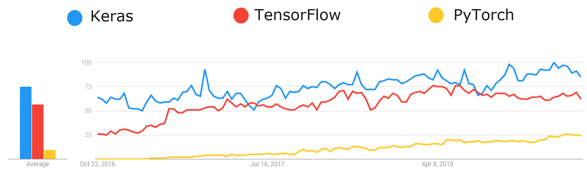
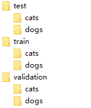

#### 前言
对于机器学习来说，数据的重要性无可厚非，大部分处理机器学习的问题都是在处理数据，包括数据的清洗，归一化等，好的数据质量能大大提高模型的预测性能

但是对与初学者来说，数据变得不那么重要，因为学习机器学习主要学习算法思想以及如何实现，要善于站在前人的肩膀上对于计算机视觉领域，前辈们已经创建许多非常强大的图片数据集，如 Image-net: 『http://www.image-net.org/ 』 Google 图片数据库 『https://storage.googleapis.com/openimages/web/index.html 』可以帮助我们加速开发模型

下面要介绍的一个框架是 Keras 对于新手非常友好，本人之前使用过一阶段的 Tensorflow 感觉比较抽象，对于想快速入门机器学习的同学， Keras 是一款不错的选择

以下是三个框架这几年的流行程度，从中我们能看出一点趋势



Keras 中有许多数据集，包括用来做二分类的 IMDB 数据集、多分类的路透社数据集、做回归的波士顿房价数据集等，而本文要介绍的是二分类的图片数据集，猫狗数据集，原始数据可以在 Kaggle 官网上进行下载 『https://www.kaggle.com/c/dogs-vs-cats/data』 如果你没有 Kaggle 帐号，我将在文后附上我已经下载的数据集供你们使用

数据格式如下：

其中训练集 1000 张，验证集 500 张，测试集 500 张，总共 4000 张。

### 猫狗大战开始
机器学习的一般步骤是：
- 准备数据

- 数据预处理（检查数据、数据归一化、将数据转换成张量等）

- 建立模型

- 查看精度和损失

- 预测

- 保存模型

  


```python
# 导入包
import os, shutil
import keras
from keras.layers import Conv2D, MaxPooling2D, Dense, Flatten  # 卷积神经网络
from keras.models import Sequential 
import matplotlib.pyplot as plt　# 绘图包
from keras.preprocessing import image # 数据处理
```


#### 查看数据
检查数据是数据处理过程中一项基本步骤，可以预防数数据路径、数据集数量、数据集格式等出现错误


```python
# 对创建的文件夹进行检查
dst_path='./img_data/small_datasets/'
train_cats_dir = os.path.join(dst_path, 'train/cats')
train_dogs_dir = os.path.join(dst_path, 'train/dogs')

test_cats_dir = os.path.join(dst_path, 'test/cats')
test_dogs_dir = os.path.join(dst_path, 'test/dogs')

validation_cats_dir = os.path.join(dst_path, 'validation/cats')
validation_dogs_dir = os.path.join(dst_path, 'validation/dogs')


print('total training cat images:', len(os.listdir(train_cats_dir)))
print('total training dog images:', len(os.listdir(train_dogs_dir)))

print('total validation cat images:', len(os.listdir(validation_cats_dir)))
print('total validation dog images:', len(os.listdir(validation_dogs_dir)))

print('total test cat images:', len(os.listdir(test_cats_dir)))
print('total test dog images:', len(os.listdir(test_dogs_dir)))

```

```
# 运行结果
total training cat images: 1000
total training dog images: 1000
total validation cat images: 500
total validation dog images: 500
total test cat images: 500
total test dog images: 500
```

####  数据预处理

- 读取图像文件。

- 将 JPEG 文件解码为 RGB 像素网格。

- 将这些像素网格转换为浮点数张量。

- 将像素值（0~255 范围内）缩放到 [0, 1] 区间（正如你所知，神经网络喜欢处理较小的输入值）。


```python
# 图像处理辅助工具的模块 
# ImageDataGenerator 类，可以快速创建 Python 生成器，能够将硬盘上的图像文件自动转换为预处理好的张量批量。
from keras.preprocessing.image import ImageDataGenerator

#### 归一化
train_datagen = ImageDataGenerator(rescale=1./255)  # 将所有图像乘以 1./255 进行缩放，即进行归一化
validation_datagen = ImageDataGenerator(rescale=1./255)


train_dir = './img_data/small_datasets/train/' # 训练集路径
validation_dir = './img_data/small_datasets/validation/' # 测试集路径


# 所有图像调整为 (150,150) # 因为使用了 binary_crossentropy损失，所以需要用二进制标签 # 批量大小为 20

train_generator = train_datagen.flow_from_directory(
    train_dir, target_size=(150, 150), batch_size=20, class_mode='binary') 


validation_generator = validation_datagen.flow_from_directory(
    validation_dir, target_size=(150, 150), batch_size=20, class_mode='binary')

# 对数据进行可视化查看，看图片和标签是否匹配，随机检查一部分
for data_batch, lable_batch in train_generator:
    x = data_batch[0]
    y = lable_batch[0]
    print("data_batch shape", data_batch.shape)
    print("lable_batch shape", lable_batch.shape)
    break

plt.imshow(image.array_to_img(x))
plt.title(str('cat' if y == 0 else 'dog'))
plt.show()    
```

```
# 输出结果
Found 2000 images belonging to 2 classes.
Found 1000 images belonging to 2 classes.
data_batch shape (20, 150, 150, 3)
lable_batch shape (20,)
```


#### 建立卷积模型
计算机视觉大部分模型都是使用卷积神经网络（CNN）


```python
def model_demo():
    model = Sequential()
    model.add(Conv2D(32, (3, 3), activation='relu', input_shape=(150, 150, 3)))
    model.add(MaxPooling2D((2, 2)))
    
    model.add(Conv2D(64, (3, 3), activation='relu'))
    model.add(MaxPooling2D((2, 2)))

    model.add(Conv2D(128, (3, 3), activation='relu'))
    model.add(MaxPooling2D((2, 2)))

    model.add(Conv2D(128, (3, 3), activation='relu'))
    model.add(MaxPooling2D((2, 2)))
    model.add(Flatten())

    model.add(Dense(512, activation='relu'))
    model.add(Dense(1, activation='sigmoid')) # 二分类，最后一层使用 sigmoid
    return model

model = model_demo()
model.summary()
```

```
_________________________________________________________________
Layer (type)                 Output Shape              Param #   
=================================================================
conv2d_1 (Conv2D)            (None, 148, 148, 32)      896       
_________________________________________________________________
max_pooling2d_1 (MaxPooling2 (None, 74, 74, 32)        0         
_________________________________________________________________
conv2d_2 (Conv2D)            (None, 72, 72, 64)        18496     
_________________________________________________________________
max_pooling2d_2 (MaxPooling2 (None, 36, 36, 64)        0         
_________________________________________________________________
conv2d_3 (Conv2D)            (None, 34, 34, 128)       73856     
_________________________________________________________________
max_pooling2d_3 (MaxPooling2 (None, 17, 17, 128)       0         
_________________________________________________________________
conv2d_4 (Conv2D)            (None, 15, 15, 128)       147584    
_________________________________________________________________
max_pooling2d_4 (MaxPooling2 (None, 7, 7, 128)         0         
_________________________________________________________________
flatten_1 (Flatten)          (None, 6272)              0         
_________________________________________________________________
dense_1 (Dense)              (None, 512)               3211776   
_________________________________________________________________
dense_2 (Dense)              (None, 1)                 513       
=================================================================
Total params: 3,453,121
Trainable params: 3,453,121
Non-trainable params: 0
_________________________________________________________________
```

#### 编译模型


```python
from keras import optimizers
model.compile(optimizer=optimizers.RMSprop(lr=1e-4), # 直接使用 RmSprop 是稳妥的。
              loss=keras.losses.binary_crossentropy, metrics=['acc']) # 二分类所以使用二元交叉熵作为损失函数
```

#### 利用批量生成器拟合模型


```python
# 得出的结果是训练集和验证集上的损失和精度
history = model.fit_generator(generator=train_generator, 
                              steps_per_epoch=100, 
                              epochs=30,  # 训练 30 轮
                              validation_data=validation_generator, 
                              validation_steps=50
                             )
```

`这段程序运行的时间会有的久，若同学们不想运行，我已经将训练好的模型保存起来，供你们使用`

#### 保存模型


```python
# 保存模型，是开发的一种习惯
model.save('cats_and_dogs_small_1.h5')
```

#### 模型预测


```python
# 读取测试集中的数据
test_dir = './img_data/small_datasets/test/'
test_datagen = ImageDataGenerator(rescale=1./255) # 归一化
# 所有图像调整为 (150,150) # 因为使用了 binary_crossentropy损失，所以需要用二进制标签 # 批量大小为 20
test_generator = test_datagen.flow_from_directory(
    test_dir, target_size=(150, 150), batch_size=20, class_mode='binary') 
```

    # 输出
    Found 1000 images belonging to 2 classes.


```python
# 可视化部分图像，看图像与标签是否相符
for data_batch, labels_batch in test_generator:
    # 用来可视化
    x = data_batch[1]
    y = labels_batch[1]
    print("data_batch shape", data_batch.shape)
    print("labels_batch shape", labels_batch.shape)
    break
    

plt.imshow(image.array_to_img(x))
plt.title(str('cat' if y == 0 else 'dog'))
plt.show()    
```

```
# 输出结果
data_batch shape (20, 150, 150, 3)
labels_batch shape (20,)
```


#### 对训练集进行预测


```python
# 对训练集进行预测，查看一下模型在训练集上的效果，若效果很差，说明模型没有训练好
model_load.evaluate_generator(train_generator, steps=20)
```


#### 对测试及进行预测


```python
from keras.models import load_model
model_load = load_model("./cats_and_dogs_small_1.h5")
model_load.evaluate(data_batch, labels_batch, batch_size=20, verbose=1)
```


```python
model_load.evaluate_generator(test_generator, steps=20)
```

#### 结果可视化


```python
# 绘制结果，这一部分的结果见下面
import matplotlib.pyplot as plt

def plot_acc_err(history):
    acc = history.history['acc']
    val_acc = history.history['val_acc']
    loss = history.history['loss']
    val_loss = history.history['val_loss']
    
    epochs = range(1, len(acc) + 1)
    plt.plot(epochs, acc, 'bo', label='Training acc')
    plt.plot(epochs, val_acc, 'b', label='Validation acc')
    plt.title('Training and validation accuracy')
    plt.legend()
    
    plt.figure() # 在另一个图像绘制
    plt.plot(epochs, loss, 'bo', label='Training loss')
    plt.plot(epochs, val_loss, 'b', label='Validation loss')
    plt.title('Training and validation loss')
    plt.legend()
    plt.show()

plot_acc_err(history)    
```

#### 处理保存的模型和训练历史

本模块是将训练好的精度和损失保存下来，方便下一次进行分析


```python
# 读取训练数据
with open("history.json", 'r') as f:
    history_load = f.readlines()

history_load = json.loads(history_load[0])
acc = history_load['acc']
val_acc = history_load['val_acc']
loss = history_load['loss']
val_loss = history_load['val_loss']

epochs = range(1, len(acc) + 1)
plt.plot(epochs, acc, 'bo', label='Training acc')
plt.plot(epochs, val_acc, 'b', label='Validation acc')
plt.title('Training and validation accuracy')
plt.legend()

plt.figure() # 在另一个图像绘制
plt.plot(epochs, loss, 'bo', label='Training loss')
plt.plot(epochs, val_loss, 'b', label='Validation loss')
plt.title('Training and validation loss')
plt.legend()
plt.show()
```


#### 结果分析

训练精度随时间线性增加，而验证精度停留在 70% 左右，验证损失仅在 10 轮后就达到最小值，然后保持不变，而训练损失则一直线性下降，直到接近于 0。

过拟合的原因主要是因为训练样本相对较少（猫狗各 2000 个）

#### 结语

我在学习的过程中，发现使用 Keras 自带的样本迭代器来训练时速度很慢，主要原因是：每次训练的时候，时间大部分消耗在 CPU  读取数据上，而真正训练的时间并不是很长，之后会介绍几种方法，不仅能`提升训练精度，也能让训练的时间可能的短`，即使你没有 GPU 来加速


#### 推荐个朋友

`Python高效编程`专注于Python 实战教程，分享 Python 进阶知识、PyQt5 图形界面系列文章以及个人学习经验

还时不时设计一些实用的 Python 脚本，欢迎关注！


#### 别忘了爱自己

别忘了热爱生活，代码敲累了，就出去走走，生活总是美好的～


