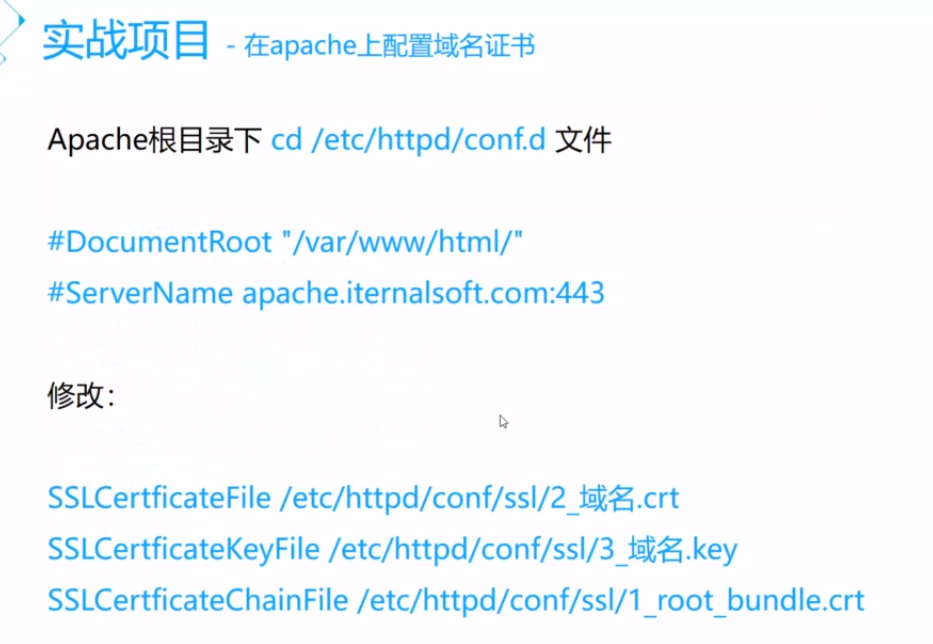

```bash

# 安装 Apache
yum install httpd -y

# 安装 ssl
yum install mod_ssl

# 从 centos 下载 ssl.conf 文件
在 /etc/httpd/conf.d 路径下

修改其中的内容
1、取消注释 
DocumentRoot "/var/www/html"
ServerName www.example.com:443  # 修改这里的域名
2、上传证书
上传 apache 证书到 /etc/ssl 下
并修改 ssl.conf 文件

# 然后重新启动 Apache
service httpd restart

```



参考：

- https://cloud.tencent.com/document/product/400/4143
- https://cloud.tencent.com/document/product/400/35243

