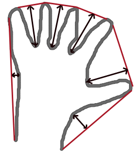

[TOC]

### 图像轮廓

#### 基本理论
轮廓可以简单地解释为连接所有连续点（沿着边界）的曲线，具有相同的颜色或强度。轮廓是形状分析和物体检测和识别的有用工具。

- 处理轮廓时，使用的是二进制图像，首先应该使用阈值处理或者边缘检测( canny )
- cv2.findContours(), cv2.drawContours()

`findContours(image, mode, method[, contours[, hierarchy[, offset]]]) -> image, contours, hierarchy`
- image: 源图像
- mode: 轮廓检索模式
    - cv2.RETR_EXTERNAL 只检测最外层轮廓
    - cv2.RETR_LIST   提取所有轮廓，并放置在 list 中。建立的轮廓不建立等级关系
    - cv2.RETR_CCOMP  提取所有轮廓，并将其组织为双层结构，顶层为连通域的外围边界，第二层为孔的内层边界，若孔内还有物体轮廓，则将其放在第一层
    - cv2.RETR_TREE  提取所有轮廓，并重新建立网状的轮廓结构
    - cv2.RETR_FLOODFILL
- method: 轮廓的近似方法
    - cv2.CHAIN_APPROX_NONE  获取每个轮廓的像素，相邻的两个点的像素位置差不超过1 
    - cv2.CHAIN_APPROX_SIMPLE 压缩水平方向，垂直方向，对角线方向的元素，只保留该方向的终点坐标，如一个矩形需要四个坐标来保存轮廓信息
    - cv2.CHAIN_APPROX_TC89_KCOS、cv2.CHAIN_APPROX_TC89_L1: 应用 Teh-Chin 链式近似算法的一个
- contours: 检测到的轮廓保存的地方，每个轮廓保存为一个点向量
- hierarchy: 包含图像的拓扑信息，图像的层次结构
- offset:   ROI 图像时用到的参数
[参数说明](https://docs.opencv.org/3.4/d3/dc0/group__imgproc__shape.html#gga819779b9857cc2f8601e6526a3a5bc71a48b9c2cb1056f775ae50bb68288b875e)
  
    

`drawContours(image, contours, contourIdx, color[, thickness[, lineType[, hierarchy[, maxLevel[, offset]]]]]) -> image`
- image: 
- contours: 轮廓保存信息的参数，数据结构为列表
- contourIdx: 轮廓绘制的标志量，若为负数，则代表绘制所有轮廓
- color: 颜色
- thickness: 轮廓线条粗细，默认值为 1，若为负值，则绘制在轮廓内部
- lineType: 线条类型默认为 cv2.LINE_8 （8 连通线型）、cv2.LINE_4（4 连通线型）、cv2.LINE_AA （抗锯齿线型）
- hierarchy: 层次结构信息
- maxLevel: 绘制轮廓的最大等级默认 cv2.INTER_MAX
- offset: 轮廓偏移参数

#### 例程


```python
import cv2
import numpy as np

img = np.zeros((300, 300, 3), dtype=np.uint8)
cv2.rectangle(img, (100, 100), (200, 200), (255, 255, 255), -1)
cv2.circle(img, (250, 250), 30, (255, 255, 255), -1)
#img = cv2.imread("./sample_img/back.jpg")
imgray = cv2.cvtColor(img, cv2.COLOR_BGR2GRAY)
ret, thresh = cv2.threshold(imgray, 127, 255, 0) 

# findContours 只能处理二值图像
contours, hierarchy = cv2.findContours(thresh, cv2.RETR_TREE, cv2.CHAIN_APPROX_SIMPLE)

count = len(contours)
for i in range(count):
    if i % 2 == 0:
        cv2.drawContours(img, contours, i, (0, 255, 0), 2, lineType=cv2.LINE_8, hierarchy=hierarchy)
    else:
        cv2.drawContours(img, contours, i, (0, 0, 255), 2, lineType=cv2.LINE_8, hierarchy=hierarchy)
    
cv2.imshow("img", img)


cv2.waitKey(0)
cv2.destroyAllWindows()
```


```python
import cv2
import numpy as np


img = cv2.imread("./sample_img/contours.jpg")
imgray = cv2.cvtColor(img, cv2.COLOR_BGR2GRAY)
ret, thresh = cv2.threshold(imgray, 119, 255, 0)
contours, hierarchy = cv2.findContours(
    thresh, cv2.RETR_CCOMP, cv2.CHAIN_APPROX_SIMPLE)


img = cv2.drawContours(img, contours, -1, (0, 255, 0), 2,
                       lineType=cv2.LINE_AA, hierarchy=hierarchy)


cv2.imshow("img", img)
cv2.imshow("thresh", thresh)

cv2.waitKey(0)
cv2.destroyAllWindows()
```


```python
import cv2
import numpy as np

def contours_demo(img):
    
    #dst = cv2.GaussianBlur(img, (3, 3), 0)
    gray = cv2.cvtColor(img, cv2.COLOR_BGR2GRAY)
    ret, binary = cv2.threshold(gray, 0, 255, cv2.THRESH_BINARY | cv2.THRESH_OTSU)
    cv2.imshow("binary image", binary)

    cloneImage, contours, hieriachy = cv2.findContours(binary, cv2.RETR_EXTERNAL, cv2.CHAIN_APPROX_SIMPLE)
    for i, contour in enumerate(contours):
        cv2.drawContours(img, contours, i, (0, 0, 255), 2)
        #print(i)
    cv2.imshow("detect contours", img)


src = cv2.imread("./sample_img/circle.png")
cv2.imshow("src", src)
contours_demo(src)


cv2.waitKey(0)
cv2.destroyAllWindows()
```

### 凸包检测及其他轮廓特征



`convexHull(points[, hull[, clockwise[, returnPoints]]]) -> hull`       
- points: 输入的二维点集
- hull: 返回的结果，即凸包
- clockwise: 操作方向标识符 True：凸包为顺时针，False：逆时针。且设定 x 轴指向右， y 轴指向上方
- returnPoints: 操作标识符，默认为 True：返回凸包的各个点，False：返回凸包各个点的指数

#### 简易例程


```python
import cv2
import numpy as np
import random

def contours_demo(img):
    
    #dst = cv2.GaussianBlur(img, (3, 3), 0)
    #gray = cv2.cvtColor(img, cv2.COLOR_BGR2GRAY)
    ret, binary = cv2.threshold(img, 0, 255, cv2.THRESH_BINARY | cv2.THRESH_OTSU)
    #cv2.imshow("binary image", binary)

    cloneImage, contours, hieriachy = cv2.findContours(binary, cv2.RETR_EXTERNAL, cv2.CHAIN_APPROX_SIMPLE)
    #for i, contour in enumerate(contours):
    #    cv2.drawContours(img, contours, i, (0, 0, 255), 2)
        #print(i)
    cv2.imshow("detect contours", img)
    
    return contours
    

img = np.zeros((600, 600), dtype=np.uint8)
for i in range(30):
    x = random.randint(200, 250)
    y = random.randint(200, 250)
    #print(x, y)
    cv2.circle(img, (x, y), 10, 255, -1)
   
contours = contours_demo(img)
cnt = contours[0]
hull = cv2.convexHull(cnt)
hullcount = hull.shape[0]
for i in range(hullcount-1):
    x0 = hull[i][0][0]
    y0 = hull[i][0][1]
    x1 = hull[i+1][0][0]
    y1 = hull[i+1][0][1]
    cv2.line(img, (x0, y0), (x1, y1), 255, 2)
    if i == hullcount-2:
        #print(x1, y1)
        x2 = hull[0][0][0]
        y2 = hull[0][0][1]
        cv2.line(img, (x1, y1), (x2, y2), 255, 2)    


cv2.imshow("dst", img)    
cv2.waitKey(0)
cv2.destroyAllWindows()
```


#### 综合例程


```python
import cv2
import numpy as np
import random

def convexHull_demo(img, sample, threshold):
    gray = cv2.cvtColor(img, cv2.COLOR_BGR2GRAY)
    
    cv2.imshow("gray", gray)
    blur = cv2.GaussianBlur(gray, (3, 3), 0)
    ret, thresh = cv2.threshold(blur, threshold, 255, cv2.THRESH_BINARY)
    cv2.imshow("thresh", thresh)
    cloneImage, contours, hierachy = cv2.findContours(thresh, cv2.RETR_LIST, cv2.CHAIN_APPROX_SIMPLE)

    hull = []
    for i in range(len(contours)-1):
        hull.append(cv2.convexHull(contours[i], True))


    for i in range(len(contours)-1): # 减 1 的作用是去掉图像最外层的轮廓，但是有些图像没有
        cv2.drawContours(sample, contours, i, (255, 0, 0), 2, cv2.LINE_8, hierachy)
        cv2.drawContours(sample, hull, i, (0, 255, 0), 2, cv2.LINE_8)
        
    cv2.imshow("sample", sample)  
    
    
def nothing(x):
    pass
        
cv2.namedWindow("sample")        
cv2.createTrackbar("threshold", "sample", 0, 255, nothing)


img = cv2.imread("./sample_img/contours_2.jpg", 1)   


while(1):
    sample = np.ones_like(img)
    threshold = cv2.getTrackbarPos("threshold", "sample")
    #print(threshold)
    convexHull_demo(img, sample, threshold)
    k = cv2.waitKey(1) & 0xff
    if k == 27:
        break


cv2.destroyAllWindows()
```


#### 轮廓近似
`approxPolyDP(curve, epsilon, closed[, approxCurve]) -> approxCurve`  以指定的精度近似多边形曲线
- curve 二维矩阵
- epsilon 指定近似精度的参数   epsilon = rate*cv2.arcLength(contours[i], True)  # rate 为趋近的比例 如取 0.1， 0.01
- closed 如果为真，则近似值曲线是闭合的(它的第一个和最后一个顶点是闭合的)


```python
import cv2
import numpy as np
import random


img = np.zeros((500, 500, 3), dtype=np.uint8)
cv2.rectangle(img, (200, 200), (400, 400), 255, -1)
cv2.rectangle(img, (250, 200), (260, 220), 0, -1)
cv2.rectangle(img, (200, 300), (220, 320), 0, -1)
gray = cv2.cvtColor(img, cv2.COLOR_BGR2GRAY)
_, binary = cv2.threshold(gray, 0, 255, cv2.THRESH_BINARY | cv2.THRESH_OTSU)
_, contours, hieriachy = cv2.findContours(binary, cv2.RETR_EXTERNAL, cv2.CHAIN_APPROX_SIMPLE)
count = len(contours)
rate = 0.01 # 不同的取值会有不同的结果
for i in range(count):
    epsilon = rate*cv2.arcLength(contours[i], True) 
    approx = cv2.approxPolyDP(contours[i], epsilon, True)
    cv2.drawContours(img, approx, -1, (0, 0, 255), 10)

for i in range(len(approx)-1):
    pt1 = (approx[i][0][0], approx[i][0][1])
    pt2 = (approx[i+1][0][0], approx[i+1][0][1])
    cv2.line(img, pt1, pt2, (0, 255, 0), 1)
    
    t = 1
    if t == 1:
        cv2.line(img, (approx[0][0][0], approx[0][0][1]), (approx[len(approx)-1][0][0], approx[len(approx)-1][0][1]), (0, 255, 0), 1)
        t = t + 1
        


cv2.imshow("dst     "+str(rate), img)    
cv2.waitKey(0)
cv2.destroyAllWindows()
```


#### 矩形边框


```python
import cv2
import numpy as np
import random


img = np.zeros((500, 500, 3), dtype=np.uint8)
cv2.rectangle(img, (100, 100), (200, 200), 255, -1)
cv2.rectangle(img, (200, 200), (300, 300), 255, -1)
gray = cv2.cvtColor(img, cv2.COLOR_BGR2GRAY)
_, binary = cv2.threshold(gray, 0, 255, cv2.THRESH_BINARY+cv2.THRESH_OTSU)
contours, hieriachy = cv2.findContours(binary, cv2.RETR_EXTERNAL, cv2.CHAIN_APPROX_SIMPLE)
count = len(contours)

for i in range(count):
    x, y, w, h = cv2.boundingRect(contours[i])
    img = cv2.rectangle(img, (x, y), (x+w, y+h), (0, 255, 0), 2)


cv2.imshow("dst", img)
cv2.waitKey(0)
cv2.destroyAllWindows()
```


#### 旋转矩形


```python
import cv2
import numpy as np
import random


img = np.zeros((500, 500, 3), dtype=np.uint8)
cv2.rectangle(img, (100, 100), (200, 150), 255, -1)
#cv2.rectangle(img, (200, 200), (300, 300), 255, -1)
cv2.circle(img, (300, 300), 50, 255, -1)
gray = cv2.cvtColor(img, cv2.COLOR_BGR2GRAY)
_, binary = cv2.threshold(gray, 0, 255, cv2.THRESH_BINARY+cv2.THRESH_OTSU)
_, contours, hieriachy = cv2.findContours(binary, cv2.RETR_EXTERNAL, cv2.CHAIN_APPROX_SIMPLE)
count = len(contours)


for i in range(count):
    rect = cv2.minAreaRect(contours[i]) # 返回 ((center_x, center_y), h, w, degree)
    print(rect)
    box = cv2.boxPoints(rect)
    box = np.int0(box)
    img = cv2.drawContours(img,[box],0,(0,0,255),2)


cv2.imshow("dst", img)
cv2.waitKey(0)
cv2.destroyAllWindows()
```

    ((300.0, 300.0), (98.99495697021484, 98.99495697021484), -45.0)
    ((150.0, 125.0), (50.0, 100.0), -90.0)


#### 最小封闭圆


```python
import cv2
import numpy as np
import random


img = np.zeros((500, 500, 3), dtype=np.uint8)
cv2.rectangle(img, (100, 100), (200, 200), 255, -1)
cv2.rectangle(img, (211, 211), (300, 300), 255, -1)
#cv2.circle(img, (300, 300), 50, 255, -1)
gray = cv2.cvtColor(img, cv2.COLOR_BGR2GRAY)
_, binary = cv2.threshold(gray, 0, 255, cv2.THRESH_BINARY+cv2.THRESH_OTSU)
_, contours, hieriachy = cv2.findContours(binary, cv2.RETR_EXTERNAL, cv2.CHAIN_APPROX_SIMPLE)
count = len(contours)


for i in range(count):
    (x, y), radius = cv2.minEnclosingCircle(contours[i])
    center = (int(x), int(y))
    radius = int(radius)
    img = cv2.circle(img, center, radius, (0, 255, 0), 2)


cv2.imshow("dst", img)
cv2.waitKey(0)
cv2.destroyAllWindows()
```


#### 拟合椭圆 （至少需要 5 个点）


```python
import cv2
import numpy as np
import random


img = np.zeros((500, 500, 3), dtype=np.uint8)
cv2.rectangle(img, (100, 100), (200, 200), 255, -1)
cv2.rectangle(img, (201, 201), (300, 300), 255, -1)
#cv2.circle(img, (300, 300), 50, 255, -1)
gray = cv2.cvtColor(img, cv2.COLOR_BGR2GRAY)
_, binary = cv2.threshold(gray, 0, 255, cv2.THRESH_BINARY+cv2.THRESH_OTSU)
_, contours, hieriachy = cv2.findContours(binary, cv2.RETR_EXTERNAL, cv2.CHAIN_APPROX_SIMPLE)
count = len(contours)


for i in range(count):
    ellipse = cv2.fitEllipse(contours[i])
    img = cv2.ellipse(img,ellipse,(0,255,0),2)


cv2.imshow("dst", img)
cv2.waitKey(0)
cv2.destroyAllWindows()
```

#### 拟合直线


```python
import cv2
import numpy as np
import random


img = np.zeros((500, 500, 3), dtype=np.uint8)
cv2.rectangle(img, (100, 100), (200, 200), 255, -1)
cv2.rectangle(img, (201, 201), (300, 300), 255, -1)
cv2.circle(img, (300, 300), 50, 255, -1)
gray = cv2.cvtColor(img, cv2.COLOR_BGR2GRAY)
_, binary = cv2.threshold(gray, 0, 255, cv2.THRESH_BINARY+cv2.THRESH_OTSU)
_, contours, hieriachy = cv2.findContours(
    binary, cv2.RETR_EXTERNAL, cv2.CHAIN_APPROX_SIMPLE)
count = len(contours)


for i in range(count):
    rows, cols = img.shape[:2]
    [vx, vy, x, y] = cv2.fitLine(contours[i], cv2.DIST_L2, 0, 0.01, 0.01)
    lefty = int((-x*vy/vx) + y)
    righty = int(((cols-x)*vy/vx)+y)
    img = cv2.line(img, (cols-1, righty), (0, lefty), (0, 255, 0), 2)


cv2.imshow("dst", img)
cv2.waitKey(0)
cv2.destroyAllWindows()
```


### 轮廓属性

纵横比（Aspect Ratio） 

extent ：是物体面积与边界矩形面积的比值 

Solidity ：坚实度是等高线面积与其凸包面积之比。

Equivalent Diameter ：等效直径是面积与等值线面积相等的圆的直径。 

Orientation 方向是物体所指向的角度

最大最小值及其位置


```python
import cv2
import numpy as np
import random


img = np.zeros((500, 500, 3), dtype=np.uint8)
cv2.rectangle(img, (100, 100), (300, 200), (255, 2, 0), -1)
cv2.rectangle(img, (211, 201), (300, 300), 255, -1)
#cv2.circle(img, (300, 300), 50, 255, -1)
gray = cv2.cvtColor(img, cv2.COLOR_BGR2GRAY)
_, binary = cv2.threshold(gray, 0, 255, cv2.THRESH_BINARY+cv2.THRESH_OTSU)
_, contours, hieriachy = cv2.findContours(
    binary, cv2.RETR_EXTERNAL, cv2.CHAIN_APPROX_SIMPLE)
count = len(contours)


cnt = contours[0]
x, y, w, h = cv2.boundingRect(cnt)
aspect_ratio = float(w)/h
print("横纵比：", aspect_ratio)


area = cv2.contourArea(cnt)
x, y, w, h = cv2.boundingRect(cnt)
rect_area = w*h
extent = float(area)/rect_area
print("extent", extent)

area = cv2.contourArea(cnt)
hull = cv2.convexHull(cnt)
hull_area = cv2.contourArea(hull)
solidity = float(area)/hull_area
print("solidity", solidity)

area = cv2.contourArea(cnt)
equi_diameter = np.sqrt(4*area/np.pi)
print("equi_diameter", equi_diameter)

(x, y), (MA, ma), angle = cv2.fitEllipse(cnt)  # 返回的是椭圆的外切矩形
print((x, y), (MA, ma))

mask = np.zeros(gray.shape, np.uint8)
cv2.drawContours(mask, [cnt], 0, 255, -1)
pixelpoints = np.transpose(np.nonzero(mask))
print(pixelpoints)
#pixelpoints = cv2.findNonZero(mask) # Numpy 里面的方法

min_val, max_val, min_loc, max_loc = cv2.minMaxLoc(gray,mask = mask)
print(min_val, max_val, min_loc, max_loc)


mean_val = cv2.mean(img,mask = mask)
print(mean_val)

cv2.imshow("dst", img)
cv2.waitKey(0)
cv2.destroyAllWindows()
```

    横纵比： 1.0
    extent 0.715341204425633
    solidity 0.838911465892598
    equi_diameter 191.826117780188
    (217.58111572265625, 178.86651611328125) (220.607177734375, 291.5225524902344)
    [[100 100]
     [100 101]
     [100 102]
     ...
     [300 298]
     [300 299]
     [300 300]]
    29.0 30.0 (211, 201) (100, 100)
    (255.0, 1.3856864953414558, 0.0, 0.0)


极端点 


```python
import cv2
import numpy as np
import random


img = np.zeros((500, 500, 3), dtype=np.uint8)
cv2.rectangle(img, (100, 100), (300, 200), 255, -1)
cv2.rectangle(img, (211, 201), (300, 300), 255, -1)
cv2.circle(img, (300, 300), 50, 255, -1)
gray = cv2.cvtColor(img, cv2.COLOR_BGR2GRAY)
_, binary = cv2.threshold(gray, 0, 255, cv2.THRESH_BINARY+cv2.THRESH_OTSU)
_, contours, hieriachy = cv2.findContours(
    binary, cv2.RETR_EXTERNAL, cv2.CHAIN_APPROX_SIMPLE)
count = len(contours)

cnt = contours[0]
leftmost = tuple(cnt[cnt[:, :, 0].argmin()][0])
rightmost = tuple(cnt[cnt[:, :, 0].argmax()][0])
topmost = tuple(cnt[cnt[:, :, 1].argmin()][0])
bottommost = tuple(cnt[cnt[:, :, 1].argmax()][0])

cv2.line(img, leftmost, (leftmost[0]+1, leftmost[1]+1), (0, 255, 0), 5)
cv2.line(img, rightmost, (rightmost[0]+1, rightmost[1]+1), (0, 255, 0), 5)
cv2.line(img, topmost, (topmost[0]+1, topmost[1]+1), (0, 255, 0), 5)
cv2.line(img, bottommost, (bottommost[0]+1, bottommost[1]+1), (0, 255, 0), 5)


cv2.imshow("dst", img)
cv2.waitKey(0)
cv2.destroyAllWindows()
```


### 图像的矩
图像矩的应用广泛，包括模式识别、目标分类、目标识别、方位估计、图像编码与重构。

图像矩描述的是图像形状的全局特征，包括图像中不同类型的几何特性。如大小、位置、方向、形状等。

一阶矩与形状有关、二阶矩显示曲线围绕直线平均值的扩展程度，三阶矩是关于平均值的对称性的测量。二阶矩和三阶矩可以导出共 7 个不变矩，而不变矩是图像的同居特性，满足平移、伸缩、旋转均不变的不变性，应用广泛。

`moments(array[, binaryImage]) -> retval` 计算图像所有的矩（最高为三阶矩）
- array: 二维数组 
- binaryImage: bool 类型，默认 False，若为 True 则所有非 0 像素为 1


`contourArea(contour[, oriented]) -> retval` 计算轮廓面积
- contour: 轮廓点（二维）
- oriented: bool 类型，面向区域标识符。为 True 返回一个带符号的面积值，正负取决于轮廓的方向，可以根据该标识符确定轮廓的位置。默认参数为 False 返回绝对值


`arcLength(curve, closed) -> retval` 计算轮廓长度（轮廓周长，曲线长度）
- curve:  二维点集
- closed: bool 类型，指示曲线是否封闭的标识符。默认封闭

#### 简易例程


```python
import cv2
import numpy as np

# 创建一个特殊的案例来说明
img = np.ones((500, 500, 3), dtype=np.uint8)*255
cv2.circle(img, (200, 200), 50, (0, 0, 0), -1)
cv2.line(img, (300, 300), (300, 400), (0, 0, 0), 1)

# 正常图片测试
#img = cv2.imread("./sample_img/Moments.jpg")


gray = cv2.cvtColor(img, cv2.COLOR_BGR2GRAY) 
blur = cv2.GaussianBlur(gray, (3, 3), 0)
canny = cv2.Canny(blur, 0, 100, 3)
_, contours, hierarchy = cv2.findContours(
    canny, cv2.RETR_TREE, cv2.CHAIN_APPROX_SIMPLE)

count = len(contours)
moment = []  # 计算矩
for i in range(count):
    moment.append(cv2.moments(contours[i], False))

mc = [] # 质心
area = [] # 面积
length = [] # 长度
for i in range(count):  # 计算中心矩（质心）
    if moment[i]['m00'] != 0:
        cx = int(moment[i]['m10']/moment[i]['m00'])
        cy = int(moment[i]['m01']/moment[i]['m00'])
    else:
        cx = cy = 9999
    mc.append([cx, cy])
    area.append(cv2.contourArea(contours[i]))
    length.append(cv2.arcLength(contours[i], True))
    print(str(i), "m00:", moment[i]["m00"],
          "opencv area:", area[i], "length:", length[i])


sample = np.zeros_like(img)
for i in range(count):
    cv2.drawContours(sample, contours, i, (0, 255, 0), 2, 8, hierarchy)
    cv2.circle(sample, (int(mc[i][0]), int(mc[i][1])), 4, (255, 0, 0))

cv2.imshow("src", img)
cv2.imshow("sample", sample)
cv2.waitKey(0)
cv2.destroyAllWindows()
```

    0 m00: 204.0 opencv area: 204.0 length: 208.0
    1 m00: 202.0 opencv area: 202.0 length: 205.65685415267944
    2 m00: 7866.0 opencv area: 7866.0 length: 332.04877281188965
    3 m00: 7820.0 opencv area: 7820.0 length: 329.70562267303467


#### 带阈值调节例程
以下程序适合小图片处理，大图片会耗费大量内存，特别是在绘制轮廓的时候


```python
import cv2
import numpy as np
import time

def moment_demo(img, sample, threshold):
    

    canny = cv2.Canny(img, threshold, threshold*2, 3)
    _, contours, hierarchy = cv2.findContours(canny, cv2.RETR_TREE, cv2.CHAIN_APPROX_SIMPLE)

    count = len(contours)
    #moment = []  # 计算矩
    area = []
    length = []
    moment = [cv2.moments(contours[i], False) for i in range(count)]
    # cx, cy 为质心计算公式
    cx = [int(moment[i]['m10']/moment[i]['m00']) if (moment[i]['m00'] != 0) else 9999 for i in range(count)]
    cy = [int(moment[i]['m01']/moment[i]['m00']) if (moment[i]['m00'] != 0) else 9999 for i in range(count)]
    
    area = [cv2.contourArea(contours[i]) for i in range(count)]
    length = [cv2.arcLength(contours[i], True) for i in range(count)]                                
    for i in range(count): # 这里会耗费很大的内存
        cv2.drawContours(sample, contours, i, (0, 255, 0), 2, 8, hierarchy) # 绘制轮廓
        cv2.circle(sample, (int(cx[i]), int(cy[i])), 4, (255, 0, 0)) # 绘制质心
        #print(str(i), "m00:", moment[i]["m00"],"opencv area:", area[i], "length:", length[i])
        
    


def nothing(x):
    pass


cv2.namedWindow("sample")
cv2.createTrackbar("threshold", "sample", 1, 255, nothing)
img = cv2.imread("./sample_img/ml.png")
gray = cv2.cvtColor(img, cv2.COLOR_BGR2GRAY)
blur = cv2.GaussianBlur(gray, (3, 3), 0)


while(1):
    t0 = time.time()
    sample = np.zeros_like(img)
    threshold = cv2.getTrackbarPos("threshold", "sample")
    moment_demo(blur, sample,threshold)
    #print(time.time()-t0)
    
    cv2.imshow("sample", sample)
    if (cv2.waitKey(1) & 0xff) == 27:
        break
    

cv2.destroyAllWindows()
```


### 分水岭算法
灰度图像的像素值当作海拔的高度，在极小值处打一个小孔，将水注入，得到一个分水岭

`watershed(image, markers) -> markers`
- image:
- makers: 

#### 例程
使用分水岭算法和距离变换分割相互接触的物体


```python
# %matplotlib notebook
import cv2
import numpy as np
import matplotlib.pyplot as plt

def opening_demo(img):
    kernel = cv2.getStructuringElement(cv2.MORPH_RECT, (5, 5))
    opening = cv2.morphologyEx(img, cv2.MORPH_OPEN, kernel)
    # opening = cv2.morphologyEx(img, 2, kernel) # 同上
    cv2.imshow("opening", opening)
    return opening


def closing_demo(img):
    kernel = cv2.getStructuringElement(cv2.MORPH_RECT, (3, 3))
    closing = cv2.morphologyEx(img, 3, kernel)
    cv2.imshow("closing", closing)
    return closing


def dilation_demo(img):
    kernel = cv2.getStructuringElement(cv2.MORPH_RECT, (5, 5))
    dilation = cv2.dilate(img, kernel, iterations=2)
    cv2.imshow("dilation", dilation)
    return dilation


def distanceTransform_demo(gray):
    """
    src: 8 位单通道
    """
    dis_transform = cv2.distanceTransform(src=gray,distanceType=cv2.DIST_L2,maskSize=5)
    scale = cv2.convertScaleAbs(dis_transform)
    normalize = cv2.normalize(dis_transform, None, 255,0, cv2.NORM_MINMAX, cv2.CV_8UC1)
    cv2.imshow("dis_transform", dis_transform)
    #cv2.imshow("scale", scale)
    cv2.imshow("normalize", normalize)
    return normalize


def watershed_demo(img):
    gray = cv2.cvtColor(img, cv2.COLOR_BGR2GRAY)
    ret, thresh = cv2.threshold(gray, 0, 255, cv2.THRESH_BINARY_INV+cv2.THRESH_OTSU)  # 看看二值化后的效果
    cv2.imshow("thresh", thresh)
    
    # 用开运算去除白点噪声
    opening = opening_demo(thresh)
    
    # 用闭运算去除物体上的孔洞
    closing = closing_demo(opening)
    
    # 膨胀物体的边界，可以确保物体的区域被保留，包含了前景物和一部分背景
    sure_bg = dilation_demo(closing)
    
    # 距离变换
    dist_transform = distanceTransform_demo(opening)
    
    # 确定前景物，大概率能确定为前景物的形状
    ret, sure_fg = cv2.threshold(dist_transform, 0.7*dist_transform.max(), 255, 0)
    cv2.imshow("sure_fg", sure_fg)

    sure_fg = np.uint8(sure_fg)

    # 获得一块区域，该区域是前景物与背景交界的一部分
    unknown = cv2.subtract(sure_bg, sure_fg)
    cv2.imshow("unknown", unknown)

    # Marker labelling 创建一个模板用来标记不同的区域，把连通的区域绘制不同的标签
    # 未知区域标记为 0，其他区域标记为不同的整数
    _, markers = cv2.connectedComponents(sure_fg)   
    
    # 使模板加 1 ，确保背景不是 0
    markers = markers + 1
    # 使背景标记为 0
    markers[unknown==255] = 0
    
    plt.imshow(markers, cmap='jet') # 画出 jet 形式的图，可以清晰的看出每个硬币的位置
    plt.title("markers jet")
    plt.xticks([]), plt.yticks([])
    # 用 OpenCV 的方式显示 colormap，但是色彩没有 plt 画出来的色彩丰富
    colormap = cv2.applyColorMap(src=np.uint8(markers), colormap=cv2.COLORMAP_JET)
    cv2.imshow("colormap", colormap)
    
    
    # 分水岭算法，得到的边界标记为 -1
    markers = cv2.watershed(img, markers)
    cv2.imshow("marker", markers)
    img[markers == -1] = [0,0,255] # 若为 -1 代表是边界
    cv2.imshow("dst", img)
    

def main():
    img = cv2.imread('./sample_img/water_coins.jpg')
    #img = cv2.resize(img, (1366, 768))
    watershed_demo(img)


main()
cv2.waitKey(0)  # 等有键输入或者1000ms后自动将窗口消除，0表示只用键输入结束窗口
cv2.destroyAllWindows()  # 关闭所有窗口
```


```python
# %matplotlib notebook
import cv2
import numpy as np
import matplotlib.pyplot as plt

def opening_demo(img):
    kernel = cv2.getStructuringElement(cv2.MORPH_RECT, (5, 5))
    opening = cv2.morphologyEx(img, cv2.MORPH_OPEN, kernel)
    # opening = cv2.morphologyEx(img, 2, kernel) # 同上
    cv2.imshow("opening", opening)
    return opening


def closing_demo(img):
    kernel = cv2.getStructuringElement(cv2.MORPH_RECT, (3, 3))
    closing = cv2.morphologyEx(img, 3, kernel)
    cv2.imshow("closing", closing)
    return closing


def dilation_demo(img):
    kernel = cv2.getStructuringElement(cv2.MORPH_RECT, (5, 5))
    dilation = cv2.dilate(img, kernel, iterations=2)
    cv2.imshow("dilation", dilation)
    return dilation


def watershed_demo(img):
    gray = cv2.cvtColor(img, cv2.COLOR_BGR2GRAY)
    ret, thresh = cv2.threshold(gray, 0, 255, cv2.THRESH_BINARY_INV+cv2.THRESH_OTSU)  # 看看二值化后的效果
    cv2.imshow("thresh", thresh)
    
    # 用开运算去除白点噪声
    opening = opening_demo(thresh)
    
    # 用闭运算去除物体上的孔洞
    closing = closing_demo(opening)
    
    # 膨胀物体的边界，可以确保物体的区域不饿保留
    sure_bg = dilation_demo(closing)
    
    
    dist_transform = cv2.distanceTransform(opening, cv2.DIST_L2, 5)
    cv2.imshow("dist_transform", dist_transform)
    
    ret, sure_fg = cv2.threshold(dist_transform, 0.7*dist_transform.max(), 255, 0)
    cv2.imshow("sure_fg", sure_fg)
    
    sure_fg = np.uint8(sure_fg)
    unknown = cv2.subtract(sure_bg, sure_fg)
    cv2.imshow("unknown", unknown)

    # Marker labelling 创建一个模板用来标记不同的区域
    # 未知区域标记为 0，其他区域标记为不同的整数
    ret, markers = cv2.connectedComponents(sure_fg)   
    
    # 使模板加 1 ，确保背景不是 0
    markers = markers + 1
    # 使背景标记为 0
    markers[unknown==255] = 0
    
    plt.imshow(markers, cmap='jet') # 画出 jet 形式的图，可以清晰的看出每个硬币的位置
    plt.xticks([]), plt.yticks([])
    

    markers = cv2.watershed(img, markers)
    img[markers == -1] = [0,0,255]
    cv2.imshow("marker", img)
    

def main():
    img = cv2.imread('./sample_img/water_coins.jpg')
    #img = cv2.resize(img, (1366, 768))
    watershed_demo(img)


main()
cv2.waitKey(0)  # 等有键输入或者1000ms后自动将窗口消除，0表示只用键输入结束窗口
cv2.destroyAllWindows()  # 关闭所有窗口
```


#### 更多资料
[分水岭分割介绍](http://www.cmm.mines-paristech.fr/~beucher/wtshed.html)
[基于距离变换和分水岭算法的图像分割](https://docs.opencv.org/3.4/d2/dbd/tutorial_distance_transform.html)

### 图像修复
`inpaint(src, inpaintMask, inpaintRadius, flags[, dst]) -> dst`
- src: 源图像 8 位单通道或三通道图像
- inpaintMask:修复掩模，为 8 位单通道图像。非 0 像素表示要修复的图像
- inpaintRadius:double 需要修补的每个点的圆形邻域，为修复算法的参考半径
- flags:修复方法标识符
    - cv2.INPAINT_NS   基于 Navier-Stokes 方程
    - cv2.INPAINT_TELEA   Alexandru Telea 


```python
import cv2
import numpy as np

drawing = False # 鼠标按下为 True
ix, iy = -1, -1


def on_mouse(event, x, y, flags, param):
    global ix, iy, drawing

    if event == cv2.EVENT_LBUTTONDOWN: # 鼠标放下
        drawing = True
        ix, iy = x, y # 鼠标放下时的坐标

    elif event == cv2.EVENT_MOUSEMOVE: # 鼠标移动
        if drawing == True:
                cv2.line(img, (x, y), (x, y), (255, 255, 255), 5)
                cv2.line(inpaintmask, (x, y), (x, y), 255, 5)

    elif event == cv2.EVENT_LBUTTONUP: # 鼠标提起，结束绘制
        drawing = False
        

img = cv2.imread("./sample_img/inpaint.jpg")
cv2.namedWindow("image")
cv2.setMouseCallback("image", on_mouse) # 功能绑定
inpaintmask = np.zeros((img.shape[0], img.shape[1]), dtype=np.uint8)

while(1):
    cv2.imshow("image", img)
    cv2.imshow("inpaintmask", inpaintmask)
    k = cv2.waitKey(1) & 0xFF
    if k == ord('c'):
        cv2.imwrite("./sample_img/inpaint_2.jpg", img)
    if k == ord('f'):
        fix_img = cv2.inpaint(img, inpaintmask, 2, cv2.INPAINT_TELEA)
        cv2.imshow("fix_img", fix_img)
    
    if k == 27:
        break
        
cv2.destroyAllWindows()
```


