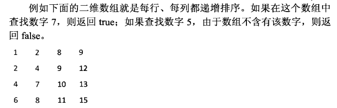

### 问题

在一个二维数组中（每个一维数组的长度相同），每一行都按照从左到右递增的顺序排序，每一列都按照从上到下递增的顺序排序。请完成一个函数，输入这样的一个二维数组和一个整数，判断数组中是否含有该整数。



剑指offer 03  [牛客网](https://www.nowcoder.com/questionTerminal/abc3fe2ce8e146608e868a70efebf62e)

### 解题思路

解算法题之前不要马上就开始写算法，要先理清一下思路

- 能否用图表的形式形象化
- 能否将其分解使其简单化
- 能否用举例使问题具体化

其次，设想几个测试案例，依据

- 边界条件，矩阵行列值大小
- 特殊输入（空值，空指针）
- 错误处理

本题中，我们可以使用题目的案例进行具体分析

并且设想几个测试用例

- 输入矩阵为空
- 查找值存在
- 查找值不存在的情况

### 解法

- 暴力破解

```python
# -*- coding:utf-8 -*-
class Solution:
    # array 二维列表
    def Find(self, target, array):
        rows = len(array)
        cols = len(array[0])
        if rows == 0 and cols == 0:  # 输入为空
            return False
        for row in range(rows):
            for col in range(cols):
                if array[row][col] == target:
                    return True
        return False
        
solution = Solution()
array = [[1, 2, 8, 9],
         [2, 4,9,12],
         [4,7,10,13],
         [6,8,11, 15]]
# array = [[]]
print(solution.Find(target=5, array=array))
```

- 寻找规律


```python
# -*- coding:utf-8 -*-
class Solution:
    # array 二维列表
    def Find(self, target, array):
        found = False
        rows = len(array)
        cols = len(array[0])
        if ((rows > 0) and (cols > 0)): # 边界检测
            row = 0
            col = cols - 1
            while((row < rows) and (col >= 0)):
                if array[row][col] == target: # 右上角的值与目标值相等就返回
                    found = True
                    break
                elif array[row][col] > target: # 右上角的值比目标值大，去掉最后一列
                    col -= 1
                else: # 当右上角的值比目标值小，就去掉这一行
                    row += 1 
        return found
        

def Test(array, target, excepted):
    result = solution.Find(target, array)
    if result == excepted:
        print("Passed. \n")
    else:
        print("Failed. \n")

def Test1(): # 数组中包含要查找的值，且查找的值是数组中的最小值
   array = [[1, 2, 8, 9], [2, 4,9,12], [4,7,10,13], [6,8,11, 15]] 
   Test(array, 1, True)

def Test2(): # 数组中包含要查找的值，且查找的值是数组中的最大值
   array = [[1, 2, 8, 9], [2, 4,9,12], [4,7,10,13], [6,8,11, 15]] 
   Test(array, 15, True)

def Test3(): # 数组中包含要查找的值，且查找的值是数组中介于最大和最小值子中间
   array = [[1, 2, 8, 9], [2, 4,9,12], [4,7,10,13], [6,8,11, 15]] 
   Test(array, 8, True)

def Test4(): # 数组中不包含要查找的值，且查找的值大于数组的最大值
   array = [[1, 2, 8, 9], [2, 4,9,12], [4,7,10,13], [6,8,11, 15]] 
   Test(array, 16, False)

def Test5(): # 数组中不包含要查找的值，且查找的值小于数组的最小值
   array = [[1, 2, 8, 9], [2, 4,9,12], [4,7,10,13], [6,8,11, 15]] 
   Test(array, 0, False)

def Test6(): # 数组中不包含要查找的值，且查找的值介于数组最大值和最小值之间，但数组中没有该值
   array = [[1, 2, 8, 9], [2, 4,9,12], [4,7,10,13], [6,8,11, 15]] 
   Test(array, 5, False) 

def Test7(): # 空列表
   array = [[]] 
   Test(array, 16, False)  

print("Test1:")
Test1()
print("Test2:", ) 
Test2()
print("Test3:", ) 
Test3()
print("Test4:",)
Test4()
print("Test5:", )  
Test5()
print("Test6:", ) 
Test6()
print("Test7:", )    
Test7()
```

