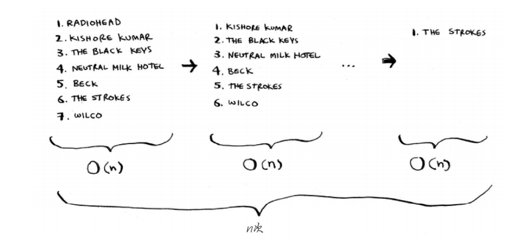

### 数组和链表

- 数组在定义时开辟空间，存储的数据少，浪费内存；存储数据满了，新的数据加入会产生转移成本。
- 数组在插入新元素时，运行时间是 O(n)
- 链表要访问后面的数据，需要从头开始访问，才能拿到后面数据的地址，若需要跳跃拿取数据，链表的速度慢
- 在中间插入元素时，链表效率更高，删除元素时，链表是更好的选择，只需修改前一个元素指向的地址即可。而使用数组时，删除元素后，必须将后面的元素都向前移。 
- 以坐座位为例，数组是一起坐，链表是分开坐
- 不同于插入，删除元素总能成功。如果内存中没有足够的空间，插入操作可能失败，但在任何情况下都能够将元素删除。 
- 『数组链表』结合的数据结构：如网站存储用户信息时使用该数据结构。这个数组包含26个元素，每个元素都指向一个链表。例如，该数组的第一个元素指向的链表包含所有以A打头的用户名，第二个元素指向的链表包含所有以B打头的用户名，以此类推。 


### 选择排序

音乐播放列表中有很多歌曲，要按播放量进行排序。

简单的方法是遍历整个列表，每次找到列表中播放量最多的歌曲，将其放进新的列表，第二次找到播放量第二的歌曲，以此类推。这样的时间复杂度是 O(n*n)（虽然不是每一次都需要查找 n 个元素，但是计算复杂度时是这样的）



```python
from typing import List

# 找到最小的元素的索引
def findSmallest(arr: List[int]) -> int:
    min_val = arr[0]
    for idx, val in enumerate(arr):
        if val <= min_val:
            min_val = val
            smallestIdx = idx
    return smallestIdx

# 选择排序
def selectionSort(arr: List[int]) -> List[int]:
    newArr = []
    for i in range(len(arr)):
        idx = findSmallest(arr)
        newArr.append(arr[idx])
        arr.pop(idx) # 参数是索引
    return newArr


selectionSort([5, 4, 3, 8, 5, 8, 1])
```


### 总结：

- 计算机内存犹如一大堆抽屉。
- 需要存储多个元素时，可使用数组或链表。
- 数组的元素都在一起。
- 链表的元素是分开的，其中每个元素都存储了下一个元素的地址。
- 数组的读取速度很快。
- 链表的**插入和删除**速度很快。
- 在同一个数组中，所有元素的类型都必须相同（都为int、 double等）。 