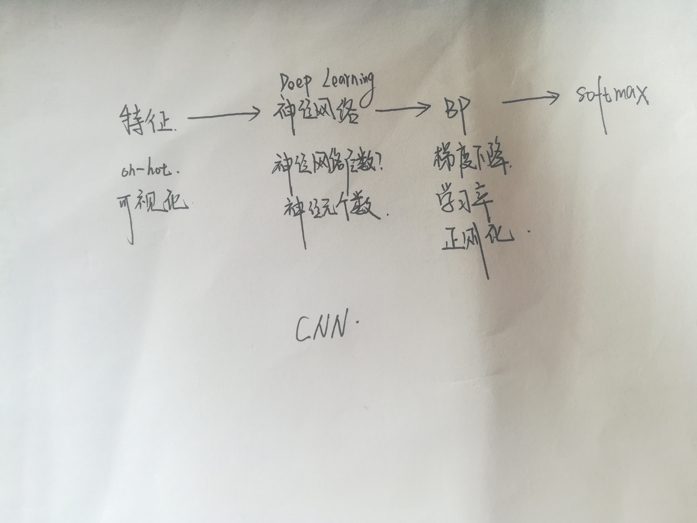
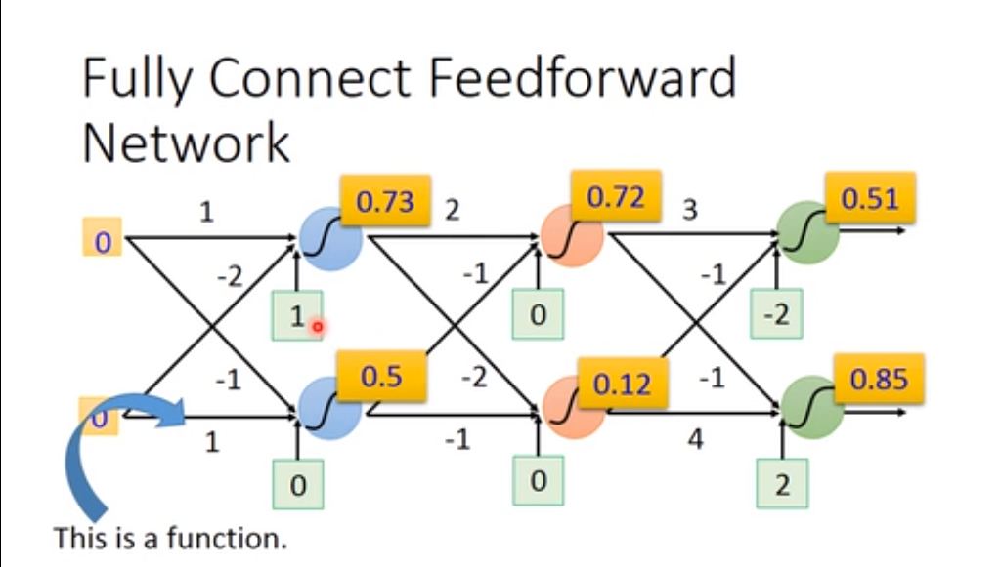
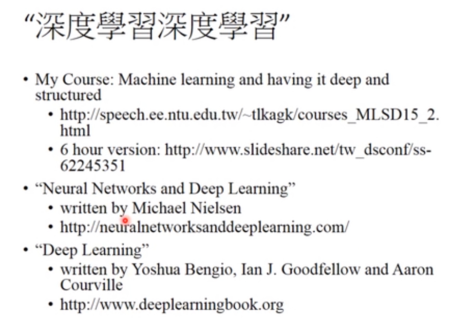
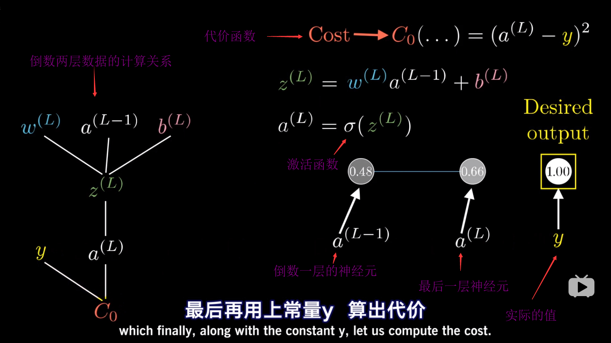
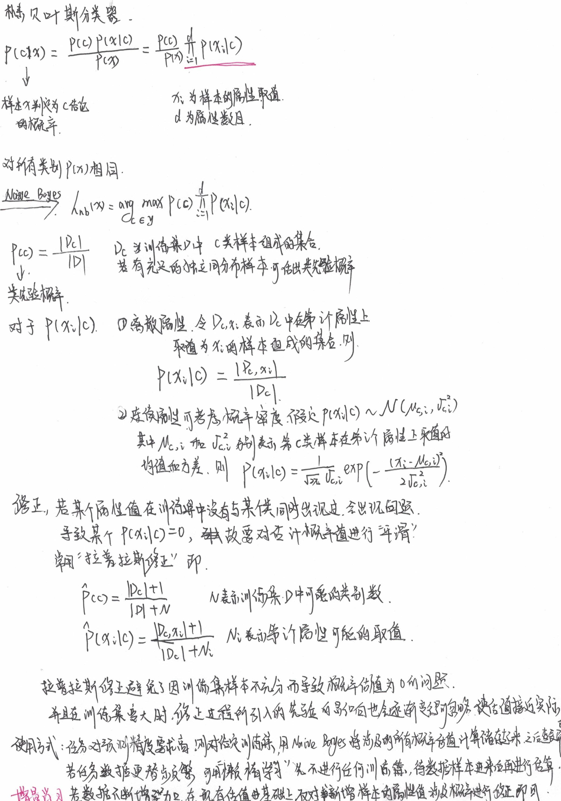

[TOC]

### 机器学习架构

[梯度下降算法与随机梯度下降](https://www.bilibili.com/video/av38405698/?p=2)

学习率

过拟合

正则化

### 损失函数
- 分类问题常用损失函数：交叉熵（刻画了两个概率分布之间的距离，而要把神经网络前向传播得到的结果变成概率分布，可以使用 Softmax 回归）
- 回归问题：均方误差

### BP 神经网络

#### 基本模型

BP 神经网络推导 [B 站](https://www.bilibili.com/video/av16577449)  [油管](https://www.youtube.com/channel/UCYO_jab_esuFRV4b17AJtAw/featured)

- BP 神经网络的本质是单个训练样本想怎样修改权重和偏置，不仅是说每个参数应该变大还是变小，还包括这些变化的比例是多大，才能最快的降低代价。
  

[Tensorflow 游乐场](https://playground.tensorflow.org/#activation=tanh&batchSize=10&dataset=circle&regDataset=reg-plane&learningRate=0.03&regularizationRate=0&noise=0&networkShape=4,2&seed=0.08965&showTestData=false&discretize=false&percTrainData=50&x=true&y=true&xTimesY=false&xSquared=false&ySquared=false&cosX=false&sinX=false&cosY=false&sinY=false&collectStats=false&problem=classification&initZero=false&hideText=false)

### SVM
[白板推导 SVM](https://www.bilibili.com/video/av28186618/) 

SVM 有三宝：间隔对偶核技巧

支持向量机的意思是：决定分类的参数只有几个样本决定，那几个样本就叫做支持向量。

硬间隔：所有的样本必须划分正确

软间隔：允许有部分样本不满足约束（正则化）

核函数：SVM 构造的是一个线性可分的分类器，但是对于无法进行线性可分的样本，可将样本从原始空间映射到一个更高维的特征空间，使得样本在这个特征空间内线性可分。在 SVM 的优化问题里，有一个内积需要计算，但是由于映射到的高维空间可能导致维度很高，甚至是无穷维，因此计算内积是困难的，故引入核函数。

常见核函数：

| 名称       | 表达式                                                       | 参数                                   |
| ---------- | ------------------------------------------------------------ | -------------------------------------- |
| 线性核     | $\kappa(x_i,x_j)=x_i^{\mathop{T}}\cdot x_j$                  |                                        |
| 多项式核   | $\kappa(x_i,x_j)=(x_i^{\mathop{T}}\cdot x_j)^d$              | $d\geq1$为多项式的次数                 |
| 高斯核     | $\kappa(x_i,x_j)=exp(-\frac{||x_i-x_j||^2}{2\sigma^2})$      | $\sigma>0$为高斯核的带宽               |
| 拉普拉斯核 | $\kappa(x_i,x_j)=exp(-\frac{||x_i-x_j||}{\sigma})$           | $\sigma>0$                             |
| Sigmoid核  | $\kappa(x_i,x_j)=tank(\beta x_i^{\mathop{T}}\cdot x_j+\theta)$ | tanh为双曲正切函数，$\beta>0,\theta<0$ |

>  核函数的选择对支持向量机的性能影响很大。

支持向量回归：

### 贝叶斯分类器

#### 极大似然估计

#### 朴素贝叶斯分类器

### 综合资料

- [微软面试100题系列](https://blog.csdn.net/v_JULY_v/column/info/ms100)
- [七月在线面试题库](https://www.julyedu.com/question/index)

