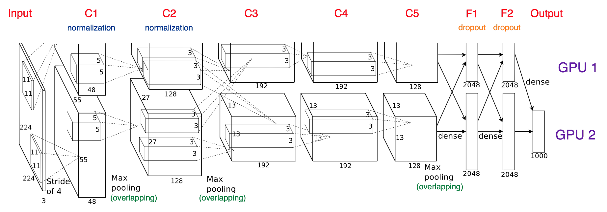

ImageNet Classification with Deep ConvolutionalNeural Networks

利用深度卷积神经网络对 ImageNet 图像分类

### 摘要

在 ImageNet LSVRC-2010 上 1200000 张图片 1000 个分类上训练网络，最后得到了错误率 37.5%（top-1）和 17%（top-5）的结果，比前人更好。该网络有 6 千万的参数和 65 万的神经元，包含 5 个卷积层，后面跟着 max-pooling 紧接着是 3  个全连接层，最后一层使用 softmax 。为了使训练更快，使用非饱和神经元和 GPU 实现卷积计算，为了减小全连接层的过拟合，使用了 dropout 技术。ILSVRC-2012 取得 top5 15.3% 的错误率（第二名是 26.2%）

- 输入图像为 227×227×3 
- Conv1 f=11*11 s=4   96 通道   ->  55x55x96  (227-11)/4+1=55
- pool1  f=3*3 s=2 -> 27x27x96   (55-3)/2+1=27
- LRN 层 Norm1 local_size=5 27x27x96
- Conv2  f=5*5 pad=2 group=2 -> 256通道  -> (27+2x2-5)/1+1=27  27x27x256
- ...

### 部分内容

- 减少过拟合技术
  - 数据增强
  - Dropout（首次使用）

### 其他

